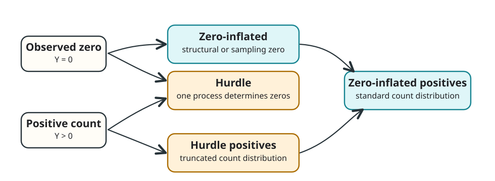

::: {.callout-note}
This is a draft post split out from the introductory zero-inflated models tutorial. The examples below still need a consistent dataset, rendered outputs, and publication-level prose before release.
:::

# Introduction

This draft covers model choices and extensions beyond the core zero-inflated modeling workflow: hurdle models, alternative count distributions, model selection strategies, prediction, and validation techniques.

## Hurdle Models

### Conceptual Difference from Zero-Inflated Models

**Zero-inflated models**: Zeros arise from a **mixture** of two processes.

- Some zeros are "structural" and could never have been non-zero.
- Some zeros are "sampling" zeros and could have been non-zero but were not.

**Hurdle models**: **All** zeros arise from one process, and positive values arise from another.

- First process: will there be any events?
- Second process: how many events, conditional on at least one?

{#fig-hurdle-vs-zi fig-alt="A hand-drawn comparison diagram showing observed zeros and positive counts split differently by zero-inflated and hurdle models."}

## Mathematical Formulation

**Hurdle model:**
$$P(Y = 0) = \theta$$
$$P(Y = k) = (1-\theta) \times \frac{f_{\text{truncated}}(k|\lambda)}{1-P_{\text{count}}(0)}, \quad k = 1, 2, 3, ...$$

**Key difference**: Hurdle models can handle **zero deflation** (fewer zeros than expected), while zero-inflated models cannot.

## Implementation

```{r hurdle_models}
#| eval: false
#| code-fold: true
#| code-summary: "Show hurdle model implementation"
# Hurdle Poisson model
hurdle_pois <- glmmTMB(fish_caught ~ group_size + hours_fishing + experience + 
                       bait_quality + weather_good,
                       ziformula = ~ experience + weather_good,
                       data = fishing_data,
                       family = truncated_poisson())

# Hurdle Negative Binomial model
hurdle_nb <- glmmTMB(fish_caught ~ group_size + hours_fishing + experience + 
                     bait_quality + weather_good,
                     ziformula = ~ experience + weather_good,
                     data = fishing_data,
                     family = truncated_nbinom2())

# Compare all models
all_models <- list(
  "Poisson" = poisson_model,
  "ZIP" = zip_model,
  "ZINB" = zinb_model, 
  "Hurdle_Poisson" = hurdle_pois,
  "Hurdle_NB" = hurdle_nb
)

comparison_all <- compare_performance(all_models, metrics = c("AIC", "BIC"))
print(comparison_all)
```

# When to Choose Hurdle vs Zero-Inflated?

**Choose zero-inflated when:**

- Strong theoretical justification for two distinct zero-generating processes
- Zeros are genuinely "extra" beyond what the count distribution predicts
- You want to model factors affecting structural and sampling zeros differently

**Choose hurdle when:**

- All zeros conceptually arise from the same process
- You need flexibility to handle zero deflation
- You want to model "participation" and "intensity" separately

# Advanced Count Distributions

## Alternative Distributions for Count Data

### Negative Binomial Parameterizations

```{r nb_parameterizations}
#| eval: false
#| code-fold: true
#| code-summary: "Show negative binomial parameterization options"
# NB1: Variance = mu(1 + alpha) [linear variance]
zinb1_model <- glmmTMB(fish_caught ~ group_size + hours_fishing + experience + 
                       bait_quality + weather_good,
                       ziformula = ~ experience + weather_good,
                       data = fishing_data,
                       family = nbinom1())

# NB2: Variance = mu(1 + mu/k) [quadratic variance] 
zinb2_model <- zinb_model

print("NB1 vs NB2 comparison:")
nb_comparison <- compare_performance(zinb1_model, zinb2_model)
print(nb_comparison)
```

**When to use NB1 vs NB2:**

- **NB1**: when variance increases linearly with the mean
- **NB2**: when variance increases quadratically with the mean

### Generalized Poisson for Under/Overdispersion

```{r generalized_poisson}
#| eval: false
#| code-fold: true
#| code-summary: "Show generalized Poisson model"
# Generalized Poisson can handle both under and overdispersion
zigp_model <- glmmTMB(fish_caught ~ group_size + hours_fishing + experience + 
                      bait_quality + weather_good,
                      ziformula = ~ experience + weather_good,
                      data = fishing_data,
                      family = genpois())

summary(zigp_model)
```

### Conway-Maxwell-Poisson for Flexible Dispersion

```{r conway_maxwell}
#| eval: false
#| code-fold: true
#| code-summary: "Show Conway-Maxwell-Poisson model"
# Conway-Maxwell-Poisson provides very flexible dispersion modeling
# Note: Requires additional computational resources
zicomp_model <- glmmTMB(fish_caught ~ group_size + hours_fishing + experience + 
                        bait_quality + weather_good,
                        ziformula = ~ experience + weather_good,
                        data = fishing_data,
                        family = compois())
```

### Zero-Altered Models for Continuous Data

For continuous data with zeros (for example, biomass or rainfall), the same two-process thinking can be useful even though the positive part is no longer a count model.

```{r zero_altered_gamma}
#| eval: false
#| code-fold: true
#| code-summary: "Show zero-altered gamma model for continuous data"
# Example: Zero-Altered Gamma for biomass data
# Create example biomass data
biomass_data <- data.frame(
  treatment = factor(rep(c("control", "fertilized"), each = 200)),
  soil_moisture = rnorm(400, 50, 15),
  temperature = rnorm(400, 25, 5)
)

# Generate zero-altered gamma data
prob_zero <- plogis(-2 + 0.5 * (biomass_data$treatment == "control"))
has_biomass <- rbinom(400, 1, 1 - prob_zero)
gamma_rate <- exp(-1 + 0.3 * (biomass_data$treatment == "fertilized"))
biomass_data$biomass <- ifelse(has_biomass == 0, 0, 
                              rgamma(400, shape = 2, rate = gamma_rate))

# Zero-Altered Gamma model
zag_model <- glmmTMB(biomass ~ treatment + soil_moisture + temperature,
                     ziformula = ~ treatment + soil_moisture,
                     data = biomass_data,
                     family = Gamma(link = "log"))
```

# Predictions and Interpretation

## Making Predictions from Zero-Inflated Models

```{r predictions}
#| eval: false
#| code-fold: true
#| code-summary: "Show prediction examples"
# Create prediction scenarios
new_scenarios <- data.frame(
  group_size = c(2, 4, 2, 4),
  hours_fishing = c(2, 6, 2, 6),
  experience = factor(c("novice", "novice", "expert", "expert"), 
                     levels = c("novice", "intermediate", "expert")),
  bait_quality = c(0, 0, 1, 1),
  weather_good = c(1, 1, 1, 1)
)

# Get our best model (ZINB)
final_model <- zinb_model

# Different types of predictions
predictions <- data.frame(
  new_scenarios,
  expected_catch = predict(final_model, newdata = new_scenarios, type = "response"),
  prob_zero_inflation = predict(final_model, newdata = new_scenarios, type = "zprob"),
  conditional_catch = predict(final_model, newdata = new_scenarios, type = "conditional")
)

predictions$prob_any_fish <- 1 - predictions$prob_zero_inflation

print(predictions)
```

**Interpretation:**

- `expected_catch`: overall expected count, including zero inflation
- `prob_zero_inflation`: probability of being a structural zero
- `conditional_catch`: expected count conditional on being in the count process
- `prob_any_fish`: probability of catching at least one fish

## Marginal Effects Visualization

```{r marginal_effects}
#| eval: false
#| code-fold: true
#| code-summary: "Show marginal effects visualization"
# Create effect data for hours fishing
effect_data <- expand.grid(
  group_size = 3,
  hours_fishing = seq(0, 8, 0.5),
  experience = "intermediate",
  bait_quality = 0,
  weather_good = 1
)

# Calculate predictions with confidence intervals
effect_predictions <- predict(final_model, newdata = effect_data, 
                             type = "response", se.fit = TRUE)

effect_plot_data <- data.frame(
  effect_data,
  predicted = effect_predictions$fit,
  lower = effect_predictions$fit - 1.96 * effect_predictions$se.fit,
  upper = effect_predictions$fit + 1.96 * effect_predictions$se.fit
)

# Plot marginal effect
ggplot(effect_plot_data, aes(x = hours_fishing, y = predicted)) +
  geom_line(color = "blue", linewidth = 1.2) +
  geom_ribbon(aes(ymin = lower, ymax = upper), alpha = 0.3, fill = "blue") +
  labs(title = "Expected Fish Catch by Hours Fishing",
       subtitle = "For intermediate angler, group size 3, good weather",
       x = "Hours Fishing", 
       y = "Expected Fish Count") +
  theme_minimal() +
  theme(plot.title = element_text(size = 14, face = "bold"))
```

# References

::: {#refs}
:::
