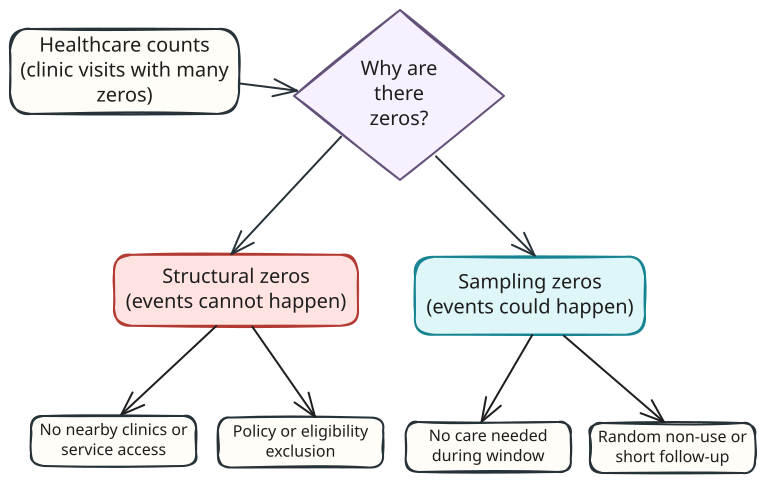
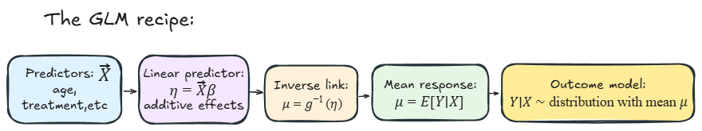
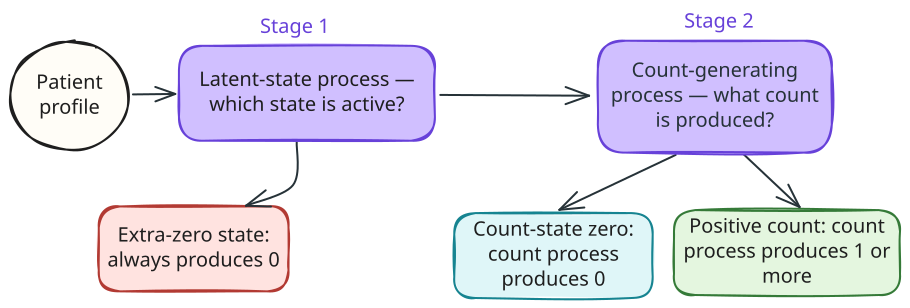

```{r}
#| label: profile-setup
#| include: false
#| eval: false
source(file.path(Sys.getenv("QUARTO_PROJECT_DIR"), "scripts", "knitr-profile.R"))
enable_knitr_chunk_profile()
```

```{=html}
<style>
.quarto-title-banner {
  background-color: rgba(6, 18, 34, 0.62);
  background-blend-mode: multiply;
  background-position: center;
  background-repeat: no-repeat;
}

/* Keep long equations inside the article column on narrow screens. MathJax
   containers are keyboard-focusable, so readers can scroll them directly. */
mjx-container[display="true"] {
  display: block;
  max-width: 100%;
  overflow-x: auto;
  overflow-y: hidden;
  padding-bottom: 0.25rem;
}

</style>
```

# Introduction

In the past couple of years, I have worked with many healthcare datasets containing large numbers of zero outcomes. This problem is not unique to healthcare, but it can make standard count models difficult to apply. Zero-inflated models offer one flexible way to represent those data.

That flexibility also makes these models harder to implement and interpret. They receive less attention than many machine-learning methods, so I initially found it difficult to locate practical guidance that connected the theory, code, diagnostics, and interpretation.

This post grew out of the notes I made while applying zero-inflated models in industry, plus some of the internal training sessions I later ran on the topic. My goal is to provide a practical, hands-on guide to understanding and implementing zero-inflated models. There is some theory involved, but no background on this topic is necessary: the article builds up from ordinary count regression before introducing the two-process model.

This tutorial covers the theoretical foundations, practical implementation, model comparison, diagnostics, and interpretation of some of the simpler and more common zero-inflated count models. A follow-up tutorial may examine hurdle models, alternative count distributions, and more advanced validation strategies.

In terms of tooling, I strongly recommend the `glmmTMB` package in R, which is flexible, widely adopted, and well suited to the generalized linear model extensions used here. The Python ecosystem for this task is not quite as mature yet, although for standard applications the `statsmodels` library is a good starting point. The modelling sequence in this tutorial is simple enough and should be easily transferable if you decide to take that approach.

## What Are Zero-Inflated Models?

In regression, zero-inflated models combine two components: a point mass at zero, which produces only zero—a component that produces only zeros—and a second distribution for the outcome. Predictors can enter both components through separate linear predictors and link functions. In this sense, zero-inflated regression models are technically defined as generalized linear mixture models.

Although they are often introduced for count data, the general framework is not limited to counts. For example, @liu2019 review zero-inflated models for non-negative continuous outcomes, while @ospina2012 develop zero-or-one-inflated beta regression for proportions.

This tutorial focuses on count data, where an observed count can arise from two distinct latent processes:

1. One that generates **structural zeros** with some probability.
2. A standard event-generating process that produces both zeros (called **sampling zeros**) and positive events.

What does this actually mean? Well, suppose you are counting clinic visits. A zero can mean at least two different things:

- the person was never really in a position to generate a visit during the study window
- the person could have generated a visit, but happened not to

The first type is a **structural zero**. The second is a **sampling zero**. A standard one-process count model, such as Poisson regression, treats both people as coming from the same count-generating process. A zero-inflated model represents both routes to zero, although it cannot tell us with certainty which route produced any individual observation.

## When Do We Need Zero-Inflated Models?

The key challenge zero-inflated models try to address is **excess zeros** in the data. However, the useful question is not "does my dataset contain a lot of zeros?", but **do the zeros plausibly come from more than one process?**

This distinction will become clearer in the following sections, but for now these are some helpful examples to keep in mind:

- **Healthcare use**: Some patients are effectively unable to generate events because they never access services (structural zeros)—for example, people living in remote areas with no nearby clinics, or those excluded by policy or eligibility criteria. Other patients could use services but happen not to during the study window (sampling zeros)—for example, healthy patients who simply do not visit in that period or patients whose condition does not require care.
- **Disease surveillance**: Some locations truly have zero prevalence for a pathogen because the pathogen cannot survive there or has been eradicated (structural zeros). Other locations harbor the pathogen but a given survey fails to detect it during that sampling round (sampling zeros) — e.g., low prevalence or imperfect tests.
- **Specialist treatments or prescriptions**: Some patients will never be eligible for a specific specialist-only procedure or advanced drug (structural zeros) — think of treatments restricted by age, comorbidity, or insurance coverage. Other patients are eligible but simply don't receive the treatment during the study window (sampling zeros) because they don't yet need it, they defer care, or the treatment is rarely used in short follow-up.

{#fig-zero-sources fig-alt="A hand-drawn flow diagram splitting healthcare count zeros into structural zeros from access or eligibility barriers and sampling zeros from no care needed or non-attendance."}

In each case, the zero may carry information about the process that generated the observation. That still leaves an important modelling caveat: excess zeros are not the same thing as proven structural zeros. A flexible one-process count model can sometimes reproduce many zeros without needing a separate latent class.

# Theoretical Foundation: From GLMs to  Mixture Models

## Generalized Linear Models

Before fitting zero-inflated models, it helps to revisit **generalized linear models** (GLMs). Counts are non-negative integers, usually right-skewed, and often have variance that changes with the mean. Ordinary linear regression does not encode those features: it can predict negative values and assumes a constant-variance normal error structure. GLMs allow us to retain a regression-style mean model while using a response distribution suited to the outcome.

A GLM connects a linear predictor to the mean of an outcome distribution through a link function. Three ingredients define that structure:

1. **Linear predictor** ($\eta_i=X_i\beta$): a linear combination of predictor values and coefficients
2. **Link function** ($g(\mu_i)=\eta_i$): the transformation connecting the linear predictor to the conditional mean
3. **Response distribution**: a distribution suited to the outcome, such as Bernoulli for a binary response or Poisson for a count

{#fig-glm-pipeline fig-alt="A hand-drawn left-to-right pipeline: predictors, linear predictor, link function, expected response, and observed outcome distribution."}

Zero-inflated count models use this structure twice: a binary component models membership in the latent extra-zero group, and a count component models the expected outcome among observations in the count-generating group. The original zero-inflated Poisson regression paper framed this as a practical way to model excess zeros in manufacturing defects [@lambert1992]; the same idea now appears across health, ecology, insurance, and many other settings.
<!-- Review paragraph below, need to sound more editorial -->
Logistic and Poisson regression provide the two building blocks. A short exponential-family refresher first recovers the logit link for a Bernoulli response; the following count-model section then applies the same logic to Poisson regression and its extensions.

## The Exponential Family

The **exponential family** is a collection of probability distributions with a shared mathematical form. This might sound abstract, but it includes most distributions you encounter in practice: normal, Poisson, binomial, gamma, and many others.

A density or probability mass function in this family can be written as:

$$f(y\mid\theta, \phi) = \exp\left\{\frac{y\theta-b(\theta)}{a(\phi)} + c(y,\phi)\right\}.$$

The notation separates the parts that govern the distribution:

- $\theta$ is the **natural parameter**;
- $\phi$ is a **dispersion parameter**, with $a(\phi)$ controlling its scale;
- $b(\theta)$ determines the mean and variance through its first two derivatives;
- $c(y,\phi)$ supplies the remaining terms needed to define a valid distribution.

Even though the formula looks daunting, the important part to keep in mind is that this format essentially *standardises* how we work with different distributions. In particular, it can be proved that for all distributions in this family, the mean and variance are:

$$E(Y)=b'(\theta), \qquad \operatorname{Var}(Y)=a(\phi)b''(\theta).$$

This common structure is what allows GLMs to pair different response distributions with a linear predictor. For a fuller treatment, McCullagh and Nelder give the classic mathematical account, while Dobson and Barnett provide a more introductory route through the same material [@mccullagh1989; @dobson2018].

### The Bernoulli Distribution

For a Bernoulli outcome $Y\in\{0,1\}$ with success probability $p$,

$$f(y\mid p) = p^y(1-p)^{1-y}
= \exp\left\{y\log\left(\frac{p}{1-p}\right)+\log(1-p)\right\}.$$

Writing the mass function this way identifies the natural parameter as

$$\theta=\log\left(\frac{p}{1-p}\right),$$

also known as the logit of $p$. Bernoulli regression therefore uses the canonical logit link:

$$\operatorname{logit}(p_i)=\log\left(\frac{p_i}{1-p_i}\right)=X_i\beta.$$

The linear predictor $X_i\beta$ can take any real value, while the inverse-logit transformation keeps $p_i$ between 0 and 1. 

Exponentiating a coefficient gives an odds ratio: $e^{\beta_j}$ is the multiplicative change in the odds for a one-unit increase in $x_j$, holding the other predictors fixed. For example, if $\beta_j=0.20$, then $e^{0.20}=1.22$, corresponding to a 22% higher odds for a one-unit increase in $x_j$. We will later use this same link to model the probability of latent extra-zero membership.

Changing the response distribution changes the canonical link and the variance assumption, but not the basic GLM architecture. We now make that transition from a binary response to a count response.

## Count-Model Building Blocks

Poisson regression is the count-data counterpart to the Bernoulli example above: its exponential-family form produces a log link, while its response distribution supplies the mean-variance relationship. That separation matters because the link and the variance assumption can succeed or fail for different reasons.

The models therefore follow a deliberate sequence. We start with Poisson regression, check its conditional variance and zero predictions, move to negative binomial regression when the count process is overdispersed, and only then ask whether a separate zero-inflation process remains useful. Each step preserves the regression-style mean model while relaxing a specific distributional restriction.

### Poisson Regression

Poisson regression is usually the standard first model for a count outcome. For person $i$, it assumes

$$Y_i \mid X_i \sim \operatorname{Poisson}(\lambda_i), \qquad \log(\lambda_i) = X_i\beta.$$

Its probability mass function has the exponential-family form

$$P(Y_i=y\mid X_i)=\frac{\lambda_i^y e^{-\lambda_i}}{y!}
=\exp\left\{y\log(\lambda_i)-\lambda_i-\log(y!)\right\}.$$

The natural parameter is therefore $\theta_i=\log(\lambda_i)$, with $b(\theta_i)=e^{\theta_i}=\lambda_i$. The canonical log link keeps the expected count $\lambda_i$ positive. Exponentiating a regression coefficient gives a rate ratio: if $\beta_j=0.20$, then $e^{0.20}=1.22$, corresponding to a 22% higher expected count for a one-unit increase in $x_j$, holding the other predictors fixed. Notice the interpretation is different from the odds ratio in the Bernoulli case: ...

The Poisson distribution has no estimated dispersion parameter, so $a(\phi)=1$ in the general exponential-family form. Its derivative relationships are therefore

$$
a(\phi)=1,
\qquad
b'(\theta_i)=b''(\theta_i)=e^{\theta_i}=\lambda_i,
$$

and hence the Poisson mean--variance relationship

$$
E(Y_i \mid X_i)=\operatorname{Var}(Y_i \mid X_i)=\lambda_i.
$$

This equality applies after conditioning on the predictors. Across the sample, people can have different values of $\lambda_i$, so combining their count distributions can produce a raw variance larger than the raw mean even when the conditional Poisson assumption holds. A large variance-to-mean ratio or a large number of zeros is therefore a warning, not evidence by itself of either conditional overdispersion or a separate zero-generating process. We assess those possibilities after fitting the Poisson mean model.

### Overdispersion and Negative Binomial Distribution

Relative to a Poisson model, **conditional overdispersion** means

$$
\operatorname{Var}(Y_i\mid X_i)>E(Y_i\mid X_i).
$$

At a given conditional mean, an overdispersed count distribution is more spread out than the corresponding Poisson distribution. It places less probability near the mean and more in the tails, including at zero and at unusually large counts. An overdispersed one-process distribution can therefore reproduce zeros that a Poisson model misses without introducing a separate extra-zero group. Unobserved differences between people, an incomplete mean model, or dependence between observations can all produce this pattern. Whatever its source, unmodelled overdispersion makes Poisson standard errors too small and may leave too little fitted probability in both the lower and upper tails.

The negative binomial distribution tries to address this by adding an extra dispersion parameter. It allows us to keep the same log mean model,

$$\log(\mu_i) = X_i\beta,$$

but relaxes the Poisson variance assumption. `glmmTMB` provides two common negative-binomial parameterizations:

$$
\begin{aligned}
\texttt{nbinom1}:\quad
  \operatorname{Var}(Y_i\mid X_i) &= \mu_i(1+\alpha), \\
\texttt{nbinom2}:\quad
  \operatorname{Var}(Y_i\mid X_i) &= \mu_i+\frac{\mu_i^2}{\phi}.
\end{aligned}
$$

In `nbinom1`, the additional variance $\alpha\mu_i$ grows linearly with the mean, and the Poisson limit occurs as $\alpha\to0$. In `nbinom2`, the additional variance $\mu_i^2/\phi$ grows quadratically, and the Poisson limit occurs as $\phi\to\infty$. The models fitted below use NB2 because its variance permits progressively greater spread at higher expected visit counts and because the zero-inflated negative binomial count component uses the same distribution. NB1 would remain plausible if the extra conditional variance increased approximately linearly with the mean.

NB2 also has a useful interpretation in terms of unobserved heterogeneity. Suppose counts are Poisson conditional on an individual event rate, but those rates vary according to a gamma distribution among people with the same observed predictors. Integrating over that variation gives the NB2 distribution, with $\mu_i^2/\phi$ measuring the additional variance due to differences in the underlying rates.

::: {.callout-caution collapse="true"}
## Mathematical details: NB2 in exponential-family form

For NB2, the conditional probability mass function is

$$
P(Y_i=y\mid X_i)
=\frac{\Gamma(y+\phi)}{\Gamma(\phi)y!}
 \left(\frac{\phi}{\phi+\mu_i}\right)^\phi
 \left(\frac{\mu_i}{\phi+\mu_i}\right)^y,
\qquad y=0,1,2,\ldots.
$$

For fixed $\phi$, we can define

$$
\theta_i=\log\left(\frac{\mu_i}{\mu_i+\phi}\right),
\qquad
b(\theta_i)=-\phi\log(1-e^{\theta_i}).
$$

The mass function can then be written in exponential-family form as

$$
P(Y_i=y\mid X_i)
=\exp\left\{
  y\theta_i-b(\theta_i)
  +\log\Gamma(y+\phi)-\log\Gamma(\phi)-\log(y!)
\right\}.
$$

Differentiating $b(\theta_i)$ recovers the NB2 conditional moments:

$$
E(Y_i\mid X_i)=b'(\theta_i)=\mu_i,
\qquad
\operatorname{Var}(Y_i\mid X_i)=b''(\theta_i)
=\mu_i+\frac{\mu_i^2}{\phi}.
$$

:::

Because NB2 assigns more probability to zero than a Poisson distribution with the same mean, it may account for some of an observed zero surplus without a separate structural-zero process. The case study therefore fits NB2 as the stronger one-process baseline before introducing a separate extra-zero mechanism.

::: {.callout-note collapse="true"}
## Generalized Poisson models

Poisson and negative binomial models are not the only count-process choices. A generalized Poisson model is another way to relax the Poisson mean-variance relationship. In a common parameterization, let $\delta$ control dispersion and define

$$D = \frac{1}{(1-\delta)^2}.$$

For conditional mean $\mu_i$, the variance is then

$$\operatorname{Var}(Y_i \mid X_i) = \mu_iD = \frac{\mu_i}{(1-\delta)^2}.$$

The ordinary Poisson model is recovered when $\delta=0$ and $D=1$. Positive $\delta$ gives $D>1$ and overdispersion; negative $\delta$ gives $D<1$ and underdispersion, subject to the admissible parameter range. In `glmmTMB`'s `genpois` family, the same variance is written as $\operatorname{Var}(Y_i\mid X_i)=\mu_i\phi_{\mathrm{GP}}^2$. Thus $\phi_{\mathrm{GP}}^2$ is the index of dispersion—the same quantity denoted by $D$ above.

This mean-variance pattern differs from `nbinom2`. Generalized Poisson variance is proportional to $\mu_i$ through $D$, whereas `nbinom2` adds the quadratic term $\mu_i^2/\phi$. I do not fit a generalized Poisson model here because the tutorial focuses on ZIP and ZINB, but it is a useful nearby option when the negative binomial variance pattern is a poor match.
:::

# Data, Exploration, and Baseline Models

Section 2 established the three main modelling possibilities carried into the case study: Poisson variation as a baseline, additional variation within a negative binomial count process, and a separate extra-zero process that can be combined with either count distribution. We now take those possibilities to the Medicare data. In general, it is good practice to progressively establish how and where more flexible one-process models fail, before implementing a two-process model.

::: {.callout-note appearance="simple" collapse="true" title="Prerequisites"}

Install the required packages before running the analysis:

```{r}
#| label: install-packages
#| eval: false
# Install packages if not already available
install.packages(c(
  "glmmTMB", "DHARMa", "performance", "parameters", "ggplot2", "dplyr",
  "gridExtra", "knitr", "catdata"
))
```
:::

## Medicare Data and Outcome

The `medcare` dataset from the `catdata` package records healthcare use for 4,406 people aged 66 and over who were covered by Medicare. The outcome, `ofp`, is each person's number of physician office visits during the observation period.

I like this example because the case for a zero-inflated model is not obvious from one dramatic spike at zero. The data instead make us work through the same questions that arise in practice: how variable are the counts, which patients have no visits, and can a standard count model reproduce the observed zeros?

The analysis uses the following packages and variables:

```{r}
#| label: load-libraries
#| message: false
#| warning: false
#| code-fold: true
#| code-summary: "Show package-loading code"
# Load required packages
library(glmmTMB)
library(DHARMa)
library(performance)
library(parameters)
library(ggplot2)
library(dplyr)
library(catdata)
```

```{r}
#| label: load-data
#| message: false
#| code-fold: true
#| code-summary: "Show data-loading code"
# Load the medical care dataset
data(medcare)

# Examine the structure of the data
head(medcare)
glimpse(medcare)
```

The variables used in this section are:

- `ofp`: Number of physician office visits (our count outcome)
- `healthpoor`: Individual has poor health (reference: average health)
- `healthexcellent`: Individual has excellent health
- `numchron`: Number of chronic conditions
- `male`: Gender (female = 0, male = 1)
- `age`: Age in decades (`6.6` represents 66 years)
- `married`: Marital status (married = 1, else = 0)

## Distribution of Visits and Observed Zeros

The outcome summary keeps the sample size, centre, spread, and frequency of zeros in one place.

```{r}
#| label: tbl-doctor-visit-summary
#| code-fold: true
#| code-summary: "Show summary table code"
#| tbl-cap: "Distribution of physician office visits (`ofp`)."

stats_tbl <- tibble::tibble(
  Metric = c(
    "Participants",
    "Zero-visit records",
    "Proportion with zero visits",
    "Median visits",
    "Mean visits",
    "Variance",
    "Variance-to-mean ratio",
    "Maximum visits"
  ),
  Value = c(
    format(nrow(medcare), big.mark = ","),
    format(sum(medcare$ofp == 0), big.mark = ","),
    sprintf("%.1f%%", 100 * mean(medcare$ofp == 0)),
    sprintf("%.0f", median(medcare$ofp)),
    sprintf("%.2f", mean(medcare$ofp)),
    sprintf("%.2f", var(medcare$ofp)),
    sprintf("%.2f", var(medcare$ofp) / mean(medcare$ofp)),
    sprintf("%.0f", max(medcare$ofp))
  )
)

knitr::kable(stats_tbl)
```

There are three key insights we can draw from @tbl-doctor-visit-summary:

- 683 people (15.5%) have no recorded visits, and zero is the most frequent single count. That is a noticeable concentration, but its size alone does not establish zero-inflation. A Poisson or negative binomial distribution can also generate zeros.

- The outcome is considerably right-skewed: the median is four visits, the mean is 5.77, and the maximum is 89 visits.

- The variance is 7.91 times the mean. This **marginal** variance-to-mean ratio warns us that a Poisson model may be too restrictive, although the relevant assumption is conditional equidispersion after accounting for the predictors. We will test that on the fitted model rather than declaring overdispersion from the raw outcome alone.

### Zero Patterns Across Patient Characteristics

By exploring the distribution of zero-visit records, we notice that they are not distributed uniformly across the observed patient characteristics.

```{r}
#| label: fig-zero-inflation-eda
#| code-fold: true
#| code-summary: "Show visualization code"
#| fig-cap: "Physician office visits and the distribution of zero-visit records across patient characteristics. The histogram is zoomed to 0–20 visits; 3.0% of observations lie above this range."
#| fig-alt: "A three-panel figure. The top panel shows a right-skewed histogram of office visits with zero as the most common count. The lower panels show that zero visits are most common among people reporting excellent health and become less common as the number of chronic conditions increases."
#| fig-width: 10
#| fig-height: 8

p1 <- ggplot(medcare, aes(x = ofp)) +
  geom_histogram(
    binwidth = 1,
    boundary = -0.5,
    fill = "#4C78A8",
    color = "white"
  ) +
  coord_cartesian(xlim = c(-0.5, 20.5)) +
  labs(
    title = "Most participants recorded relatively few visits",
    x = "Physician office visits",
    y = "Participants"
  ) +
  theme_minimal() +
  theme(plot.title = element_text(face = "bold"))

health_zeros <- medcare |>
  mutate(health_status = case_when(
    healthpoor == 1 ~ "Poor",
    healthexcellent == 1 ~ "Excellent",
    TRUE ~ "Average"
  )) |>
  mutate(
    health_status = factor(
      health_status,
      levels = c("Poor", "Average", "Excellent")
    )
  ) |>
  group_by(health_status) |>
  summarise(prop_zeros = mean(ofp == 0), .groups = "drop")

p2 <- health_zeros |>
  ggplot(aes(x = health_status, y = prop_zeros)) +
  geom_col(fill = "#F58518", width = 0.7) +
  scale_y_continuous(
    labels = function(x) paste0(round(100 * x), "%"),
    limits = c(0, 0.27)
  ) +
  labs(
    title = "Zeros vary by reported health",
    x = "Self-reported health",
    y = "Zero-visit records"
  ) +
  theme_minimal() +
  theme(plot.title = element_text(face = "bold"))

chronic_zeros <- medcare |>
  group_by(numchron) |>
  summarise(
    prop_zeros = mean(ofp == 0),
    participants = n(),
    .groups = "drop"
  ) |>
  filter(participants >= 20)

p3 <- chronic_zeros |>
  ggplot(aes(x = numchron, y = prop_zeros)) +
  geom_col(fill = "#54A24B", width = 0.75) +
  scale_x_continuous(breaks = chronic_zeros$numchron) +
  scale_y_continuous(
    labels = function(x) paste0(round(100 * x), "%"),
    limits = c(0, 0.32)
  ) +
  labs(
    title = "Zeros fall as chronic conditions increase",
    x = "Chronic conditions",
    y = "Zero-visit records"
  ) +
  theme_minimal() +
  theme(plot.title = element_text(face = "bold"))

gridExtra::grid.arrange(
  p1,
  p2,
  p3,
  layout_matrix = rbind(c(1, 1), c(2, 3))
)
```

The descriptive pattern is clearest for chronic conditions. About 29% of people with no chronic conditions recorded zero visits, compared with 9% of those with two conditions and 6% of those with three. The final bars are based on smaller groups, so the overall decline matters more than every local change.

Self-reported health shows a less linear pattern. The zero proportion is highest for people reporting excellent health (24%), followed by average health (15%) and poor health (11%). These are unadjusted comparisons: age, sex, marital status, and chronic conditions differ between the groups. We therefore cannot read the bars as isolated health-status effects, still less as evidence that any particular zero is structural.

What the plots do establish is heterogeneity. The probability of a zero changes with observed patient characteristics, which makes a separate zero process plausible enough to investigate. It does not yet tell us whether a zero-inflated model will outperform an overdispersed one-process model.

### Adjusted Associations with an Observed Zero

Collapsing the outcome to **zero versus one or more visits** allows an adjusted analysis of the observed zero pattern. This logistic regression is not the zero component of a fitted zero-inflated model and cannot identify which observed zeros are structural. It asks only whether the adjusted probability of recording no visits varies with the available predictors.

In applied work, I would use this step to start a conversation with domain experts. A coefficient can show that a group has more or fewer zero records after adjustment, but it cannot tell us whether those zeros arise from good health, poor access, avoidance, eligibility rules, or an omitted variable.

```{r}
#| label: tbl-logistic-analysis
#| cache: true
#| code-fold: true
#| code-summary: "Show logistic model code"
#| tbl-cap: "Adjusted associations with recording zero physician office visits."
# Create binary indicator: 1 = zero visits, 0 = any visits
medcare$no_visits <- ifelse(medcare$ofp == 0, 1, 0)

# Fit logistic regression
logistic_model <- glm(
  no_visits ~ healthpoor + healthexcellent + numchron + age + male + married,
  data = medcare,
  family = binomial()
)

logistic_table <- model_parameters(
  logistic_model,
  exponentiate = TRUE
) |>
  filter(Parameter != "(Intercept)") |>
  transmute(
    Predictor = recode(
      Parameter,
      healthpoor = "Poor vs average health",
      healthexcellent = "Excellent vs average health",
      numchron = "Chronic conditions (per condition)",
      age = "Age (per decade)",
      male = "Male vs female",
      married = "Married vs not married"
    ),
    `Odds ratio` = sprintf("%.2f", Coefficient),
    `95% CI` = sprintf("%.2f–%.2f", CI_low, CI_high),
    `p-value` = format.pval(p, digits = 2, eps = 0.001)
  )

knitr::kable(logistic_table, align = c("l", "r", "c", "r"))
```

@tbl-logistic-analysis shows that each additional chronic condition is associated with 42% lower odds of recording zero visits (odds ratio 0.58, 95% CI 0.53–0.63). Men have 70% higher odds of a zero than women, while married participants have 36% lower odds than those who are not married. These estimates describe associations conditional on the other variables; they do not establish causal effects.

The health-status coefficients point towards higher adjusted odds of a zero for both poor and excellent health, but the confidence intervals include 1. The data therefore do not support a clear adjusted health-status association in this specification. Likewise, the age estimate suggests that older cohorts have slightly lower odds of a zero, but its confidence interval also includes 1.

This difference between the descriptive plot and the adjusted model is useful rather than contradictory. The plot compares health groups as observed; the regression compares people with the same included covariates. Neither analysis identifies structural zeros. 

Together with the descriptive plots, this model shows that zero outcomes have structure worth modelling and that their interpretation depends on the adjustment set.

## Poisson Baseline

The standard starting point for count data is a Poisson regression. Even when we expect it to fail, this model provides a useful baseline:

- What relationships would a one-process count model estimate?
- How badly does the variance assumption break?
- How many zeros would this simpler model expect?

For this application, the important Poisson assumptions are:

1. **Conditional distribution**: Given the predictors, each person's count follows a Poisson distribution.
2. **Conditional equidispersion**: The conditional variance equals the conditional mean, $$\text{Var}(Y_i \mid X_i) = E(Y_i \mid X_i)$$
3. **Independent records**: Participants are independent after conditioning on the modelled predictors.
4. **Comparable exposure**: Each count covers the same observation window; otherwise the model needs an exposure offset.

We will first interpret the conditional-mean estimates, then check whether the Poisson variance and zero probabilities fit the data. Unlike the logistic model, which asked whether a person recorded no visits, the Poisson model uses the entire count and asks how the average number of visits changes with the predictors. It therefore provides a baseline model for the count process.

```{r}
#| label: tbl-poisson-analysis
#| cache: true
#| code-fold: true
#| code-summary: "Show Poisson model code"
#| tbl-cap: "Poisson regression estimates for physician office visits."
# Fit Poisson model
count_formula <- ofp ~ healthpoor + healthexcellent + numchron +
  age + male + married

poisson_model <- glm(
  count_formula,
  data = medcare,
  family = poisson()
)

poisson_table <- model_parameters(
  poisson_model,
  exponentiate = TRUE
) |>
  filter(Parameter != "(Intercept)") |>
  transmute(
    Predictor = recode(
      Parameter,
      healthpoor = "Poor vs average health",
      healthexcellent = "Excellent vs average health",
      numchron = "Chronic conditions (per condition)",
      age = "Age (per decade)",
      male = "Male vs female",
      married = "Married vs not married"
    ),
    `Rate ratio` = sprintf("%.2f", Coefficient),
    `95% CI` = sprintf("%.2f–%.2f", CI_low, CI_high),
    `p-value` = format.pval(p, digits = 2, eps = 0.001)
  )

knitr::kable(poisson_table, align = c("l", "r", "c", "r"))
```

@tbl-poisson-analysis presents the results of the Poisson regression. As a quick reminder, a Poisson rate ratio describes a proportional difference in the expected count: the average number of visits predicted for people with the same included characteristics.

Here, under the Poisson mean model, poor health is associated with a 29% higher expected visit count than average health, while excellent health is associated with a 30% lower count. Each additional chronic condition is associated with an 18% increase. Men have an expected count about 10% lower than women, and a decade of age is associated with a 5% reduction. The estimate for marital status is essentially null.

## Where the Poisson Model Fails

The fitted mean structure does not establish that the Poisson distribution describes the conditional variation. The Pearson residuals provide a direct assessment of equidispersion after adjustment for the predictors.
<!-- Instead of extracting p-value, the code below prints the value - this is not very scientific and reproducible -->
```{r}
#| label: tbl-poisson-overdispersion
#| code-fold: true
#| code-summary: "Show overdispersion diagnostic code"
#| tbl-cap: "Pearson overdispersion diagnostic for the Poisson model."

overdispersion_check <- check_overdispersion(poisson_model)

overdispersion_table <- tibble::tibble(
  Metric = c(
    "Pearson chi-squared",
    "Residual degrees of freedom",
    "Dispersion ratio",
    "p-value"
  ),
  Value = c(
    format(
      round(overdispersion_check$chisq_statistic),
      big.mark = ","
    ),
    format(
      overdispersion_check$residual_df,
      big.mark = ","
    ),
    sprintf("%.2f", overdispersion_check$dispersion_ratio),
    "< 0.001"
  )
)

knitr::kable(overdispersion_table)
```

::: {.callout-tip}
## What is overdispersion?

Remember that overdispersion occurs when the conditional variance of the observed counts exceeds the variance allowed by the model. For a Poisson model, the conditional mean and variance must be equal. A dispersion ratio substantially above 1 indicates that this assumption is inadequate.
:::

The dispersion ratio is 7.20, well above the value of 1 expected under a Poisson model. The observed visit counts therefore vary much more than the model permits under the Poisson assumption. This overdispersion makes the model-based standard errors too small and the corresponding confidence intervals and p-values too optimistic. The rate ratios still summarize the fitted mean structure, but this means that the Poisson model does not provide reliable inference for these data.

Overdispersion identifies the Poisson model as inadequate but does not identify the source of the extra variation. The next one-process candidate is therefore negative binomial regression, which relaxes equidispersion without introducing a latent extra-zero group.

## Negative-Binomial Fit and Zero-Frequency Comparison

The negative binomial baseline retains `count_formula`, so it makes the same conditional comparisons as the Poisson model. Its `nbinom2` variance, $\mu_i + \mu_i^2/\phi$, allows variation to increase faster than the mean.

```{r}
#| label: fit-nb-baseline
#| cache: true
#| output: false

nb_model <- glmmTMB(
  count_formula,
  data = medcare,
  family = nbinom2()
)
```

The fitted dispersion parameter is $\hat{\phi} =$ `r sprintf("%.2f", sigma(nb_model))`. This finite value allows substantially more conditional variation than Poisson; the Poisson limit would require $\phi \to \infty$. The model still treats every participant as arising from one count-generating process.

Zero prediction isolates one important consequence of the different variance assumptions. For participant $i$, the fitted Poisson probability of zero is

$$P(Y_i = 0) = e^{-\hat{\lambda}_i}$$

whereas the fitted NB2 probability is

$$P(Y_i = 0) = \left(\frac{\hat{\phi}}{\hat{\phi}+\hat{\mu}_i}\right)^{\hat{\phi}}.$$

Summing the person-specific probabilities gives the expected number of zero-visit records under each model.

```{r}
#| label: tbl-zero-comparison
#| code-fold: true
#| code-summary: "Show zero-frequency comparison code"
#| tbl-cap: "Zeros expected from the fitted one-process models. The data contain 683 observed zero-visit records."
# Observed zeros
observed_zeros <- sum(medcare$ofp == 0)

# Predicted zeros from Poisson model
poisson_pred <- predict(poisson_model, type = "response")
poisson_zero_prob <- exp(-poisson_pred)  # P(Y=0) for Poisson
expected_zeros_poisson <- sum(poisson_zero_prob)

# Predicted zeros from negative binomial model
nb_mean <- predict(nb_model, type = "conditional")
nb_dispersion <- predict(nb_model, type = "disp")
nb_zero_prob <- dnbinom(0, mu = nb_mean, size = nb_dispersion)
expected_zeros_nb <- sum(nb_zero_prob)

zero_comparison <- tibble::tibble(
  Model = c("Poisson", "Negative binomial (NB2)"),
  `Expected zeros` = round(c(
    expected_zeros_poisson,
    expected_zeros_nb
  )),
  `Observed minus expected` = observed_zeros - `Expected zeros`,
  `Expected / observed` = sprintf(
    "%.1f%%",
    100 * `Expected zeros` / observed_zeros
  )
)

knitr::kable(
  zero_comparison,
  align = c("l", "r", "r", "r")
)
```

The fitted Poisson model expects approximately 37 zero-visit records, only 5.4% of the 683 observed. NB2 expects approximately 623, or 91.2% of the observed number. Allowing extra variation within one count process therefore explains most of what initially looked like a zero surplus.

The remaining shortfall is about 60 zero records. That discrepancy keeps a separate extra-zero process under consideration, but it does not prove that such a process exists. Misspecification of the conditional mean, other forms of heterogeneity, or a different count distribution could also affect zero prediction.

The baseline analysis has therefore narrowed rather than settled the question. Poisson is too restrictive, while NB2 captures most of the dispersion and zero frequency without a latent class. Section 4 introduces the extra-zero mechanism so that its additional structure can be compared with this stronger one-process benchmark.

# How Zero-Inflated Models Work

## A Latent Two-Process Model

Unlike the negative binomial baseline, which keeps every participant in one count process, a zero-inflated model allows either of two states to generate each observed count. For participant $i$, we introduce $S_i$ as a binary indicator of that state.

- $S_i=1$ means the **extra-zero state** is active. In this state, the recorded number of visits must be zero.
- $S_i=0$ means the **count-generating state** is active. This state can produce either zero visits or a positive number of visits.

The state is *latent* because it is not recorded in the data. When a participant has zero visits, we do not know which state generated that zero. The idea is to model the probability that an individual patient will fall under each state.

This probability may vary across patient profiles. Let $Z_i$ contain the predictors used for this part of the model, and let $\pi_i$ be the resulting probability that participant $i$ is in the extra-zero state. We write

$$
\begin{aligned}
S_i \mid Z_i &\sim \operatorname{Bernoulli}(\pi_i), \\
P(S_i=1\mid Z_i) &= \pi_i.
\end{aligned}
$$

In other words, $S_i$ takes the value 1 with probability $\pi_i$, based on the participant's zero-inflation predictors $Z_i$.

Now let $Y_i$ be the observed number of visits and let $X_i$ contain the predictors used for the count component. The outcome model formalizes the two states described above:

$$
\begin{aligned}
Y_i \mid S_i=1 &\equiv 0, \\
Y_i \mid S_i=0,X_i &\sim f_c(\,\cdot\,;\mu_i,\psi).
\end{aligned}
$$

When the extra-zero state is active, by definition the number of visits must be zero. In the count-generating state, visits follow $f_c$, a count distribution with mean $\mu_i$. The placeholder $\psi$ represents a family-specific dispersion parameter when one is required: it is absent for Poisson and equals $\phi$ for the NB2 model used later.

The central point is simpler than the notation: the extra-zero state always produces zero, whereas the count-generating state can produce either zero or a positive count. @fig-zero-inflated-process illustrates the two-stage process.

{#fig-zero-inflated-process fig-alt="A hand-drawn two-stage model diagram: a patient record enters a zero-inflation process, which can produce an extra zero or pass the record to a count process that can produce zero or one or more visits."}

For the Medicare data, the two components therefore ask different questions. The zero-inflation component asks which patient profiles receive a higher probability of the extra-zero state. The count component asks how expected visits change within the count-generating state.

## Mixture Probabilities and Likelihood

Zeros are ambiguous because either latent state can produce them. Positive counts are not: they can come only from the count-generating state. This asymmetry gives the model information about both components. It estimates them jointly from all observations rather than classifying the zeros first and then fitting separate regressions.

Let $f_c(k;\mu_i,\psi)$ denote the probability that the count component assigns to the value $k$. The possible routes are:

- If $y_i=0$, the observation may come directly from the extra-zero state, with probability $\pi_i$, or from the count-generating state producing zero, with probability $(1-\pi_i)f_c(0;\mu_i,\psi)$.
- If $y_i>0$, the observation has one possible route: the count-generating state, with probability $(1-\pi_i)f_c(y_i;\mu_i,\psi)$.

The likelihood contribution $L_i$ is the probability that the model assigns to the outcome observed for participant $i$. The two cases above give

$$
L_i(\pi_i,\mu_i,\psi)
=
\begin{cases}
\pi_i+(1-\pi_i)f_c(0;\mu_i,\psi), & y_i=0, \\
(1-\pi_i)f_c(y_i;\mu_i,\psi), & y_i>0.
\end{cases}
$$

In each case, $L_i$ is the probability that the model assigns to participant $i$'s observed outcome. For a zero, the contribution adds the probabilities of both routes instead of choosing one. Across the sample, these contributions form a single objective for estimating the count, zero-inflation, and dispersion parameters together.

::: {.callout-caution collapse="true" title="The full likelihood"}

Multiplying the contributions from all $n$ participants gives the full likelihood. The coefficient vectors $\beta$ and $\gamma$ govern the count and zero-inflation components, respectively:

$$
L(\beta,\gamma,\psi)
=
\prod_{i=1}^{n}
L_i\bigl(\pi_i(\gamma),\mu_i(\beta),\psi\bigr).
$$

Maximizing this product estimates the count, zero-inflation, and dispersion parameters jointly.

:::

Joint estimation also explains why the preliminary logistic regression in @tbl-logistic-analysis is not the fitted zero-inflation component. The preliminary regression models the observed event $Y_i=0$, regardless of which state produced the zero. The fitted zero-inflation component models the latent event $S_i=1$. These are different outcomes: the probability of an observed zero includes both routes, whereas $\pi_i$ is the model probability of the extra-zero state.

Because the state remains unobserved, a zero raises the practical question: given that we observed a zero, what is the probability that it came from the extra-zero state rather than from the count-generating state? The posterior probability below answers that question. Bayes' rule first expresses it in terms of model probabilities:

$$
\begin{aligned}
P(S_i=1\mid Y_i=0,X_i,Z_i)
&=
\frac{
P(Y_i=0\mid S_i=1)P(S_i=1\mid Z_i)
}{
P(Y_i=0\mid X_i,Z_i)
} \\
&=
\frac{
1\times\pi_i
}{
\pi_i+(1-\pi_i)f_c(0;\mu_i,\psi)
}.
\end{aligned}
$$

The first numerator term equals one because the extra-zero state always produces zero. The prior model probability of that state is $\pi_i$ by definition of the zero-inflation component. The denominator contains both routes to an observed zero: the extra-zero route and a zero from the count-generating state. For a positive count, the posterior probability of the extra-zero state is zero because that state cannot produce a positive value.

For a concrete example with a Poisson count component, suppose the model assigns observations with a particular covariate profile an extra-zero probability $\pi_i=0.15$ and a count-component mean $\lambda_i=3.2$.

- Within the count-generating state, the probability of zero visits is $e^{-3.2}=0.041$, or 4.1%.
- Combining both routes gives an overall zero probability of $0.15+0.85(0.041)=0.185$, or 18.5%.
- If an observation with this profile equals zero, the posterior probability of the extra-zero state is $0.15/0.185\approx0.81$, or 81%.

This posterior probability therefore updates uncertainty about the latent state. Because the count component considers zero unlikely for this profile, observing zero shifts much of the model’s probability toward the extra-zero state. This soft assignment helps estimate the two components jointly.

## Mixture Mean and Variance

Once the model has estimated the extra-zero probability and the behaviour of the count-generating state, we can ask what it predicts for observed visits. Here, $\mu_i$ is the mean of the chosen count distribution for participant $i$ within the count-generating state. Let $V_c(\mu_i)$ denote the corresponding variance:

$$
\begin{aligned}
E(Y_i\mid S_i=0,X_i) &= \mu_i, \\
\operatorname{Var}(Y_i\mid S_i=0,X_i) &= V_c(\mu_i).
\end{aligned}
$$

In a single-process count model, $\mu_i$ would also be the expected observed count. In a zero-inflated model, however, the model assigns some probability to an always-zero state. We must average over both states to obtain expected observed visits.

The extra-zero state contributes zero with probability $\pi_i$, while the count-generating state contributes an average of $\mu_i$ with probability $1-\pi_i$. Therefore,

$$
E(Y_i\mid X_i,Z_i)
=\pi_i(0)+(1-\pi_i)\mu_i
=(1-\pi_i)\mu_i.
$$

This **conditional mixture mean** is conditional on the observed predictors $X_i$ and $Z_i$, but averages over the unobserved state $S_i$. It is the quantity we need when comparing expected visits across patient profiles. Reporting $\mu_i$ instead would describe only the count-generating state and would overstate expected observed visits whenever $\pi_i>0$.

The mean alone does not tell us how observations are distributed around that average. Two fitted distributions can predict the same expected number of visits while assigning very different probabilities to zero, moderate, and high counts. The mixture variance summarizes this spread, so it helps us judge whether the fitted distribution represents the observed pattern of visits.

::: {.callout-caution collapse="true" title="Deriving the mixture variance"}

The [law of total variance](https://en.wikipedia.org/wiki/Law_of_total_variance) separates variation within the latent states from variation between their conditional means.

**Within-state variation** is the variation that remains after fixing the latent state. The extra-zero state contributes no variance because it always produces zero. The count-generating state contributes $V_c(\mu_i)$ and occurs with probability $1-\pi_i$. Therefore,

$$
\begin{gathered}
E\!\left[
\operatorname{Var}(Y_i\mid S_i,X_i,Z_i)
\right] \\
=\pi_i(0)+(1-\pi_i)V_c(\mu_i) \\
=(1-\pi_i)V_c(\mu_i).
\end{gathered}
$$

**Between-state variation** arises because the states have different means: zero in the extra-zero state and $\mu_i$ in the count-generating state. The state-specific mean can be written as $\mu_i(1-S_i)$. Because $S_i$ is Bernoulli with probability $\pi_i$,

$$
\begin{gathered}
\operatorname{Var}\!\left[
E(Y_i\mid S_i,X_i,Z_i)
\right] \\
=\mu_i^2\operatorname{Var}(1-S_i) \\
=\pi_i(1-\pi_i)\mu_i^2.
\end{gathered}
$$

Adding the within-state and between-state contributions gives the mixture variance:

$$
\operatorname{Var}(Y_i\mid X_i,Z_i)
=
\underbrace{(1-\pi_i)V_c(\mu_i)}_{\text{within-state variation}}
+
\underbrace{\pi_i(1-\pi_i)\mu_i^2}_{\text{between-state variation}}.
$$

:::

The count distribution determines $V_c(\mu_i)$. A Poisson count state has $V_c(\mu_i)=\mu_i$, giving a **zero-inflated Poisson (ZIP)** model. An NB2 count state has $V_c(\mu_i)=\mu_i+\mu_i^2/\phi$, giving a **zero-inflated negative-binomial (ZINB)** model. The resulting mixture variances are shown below.

::: {#tbl-zero-inflated-moments .responsive}

| Model | Count-state zero probability $f_c(0)$ | Count-state variance $V_c(\mu_i)$ | Conditional mixture variance |
|:--|:--|:--|:--|
| ZIP | $e^{-\mu_i}$ | $\mu_i$ | $(1-\pi_i)\mu_i+\pi_i(1-\pi_i)\mu_i^2$ |
| ZINB (NB2) | $\left(\dfrac{\phi}{\phi+\mu_i}\right)^\phi$ | $\mu_i+\dfrac{\mu_i^2}{\phi}$ | $(1-\pi_i)\left(\mu_i+\dfrac{\mu_i^2}{\phi}\right)+\pi_i(1-\pi_i)\mu_i^2$ |

Count-component probabilities and resulting mixture variances for ZIP and ZINB.
:::

Both models have conditional mixture mean $(1-\pi_i)\mu_i$. Their difference lies in the spread around that mean. ZIP uses a Poisson count state, whereas ZINB adds the term $\mu_i^2/\phi$ and therefore allows overdispersion within the count-generating state. As $\phi\to\infty$, that additional variation disappears and the ZINB expressions approach their ZIP counterparts.

For the Medicare case study, the mean identity tells us how to calculate expected observed visits, while the variance distinguishes what each count distribution can represent. The next section connects $\pi_i$ and $\mu_i$ to predictors and asks how changes in either component affect the overall mean.

## Regression and Overall Effects

We have seen that the overall mean depends on both the count-state mean $\mu_i$ and the extra-zero probability $\pi_i$. The next question is then: how does a predictor change that mean?

In a zero-inflated model, a predictor may change expected visits within the count-generating state, the probability of the extra-zero state, or both. Its component coefficient therefore need not describe its association with observed visits.

Let $X_i$ contain the count-component predictors and let $\beta$ contain their coefficients. Let $Z_i$ contain the zero-inflation predictors and let $\gamma$ contain their coefficients. In `glmmTMB`, the zero-inflation component always uses a logit link. The count-component link is more flexible: the log link is the default for the Poisson and NB2 distributions used here, as it is for most count distributions available in `glmmTMB`, but it can be changed. The models in this tutorial therefore use

$$
\begin{aligned}
\log(\mu_i) &= X_i\beta, \\
\operatorname{logit}(\pi_i) &= Z_i\gamma.
\end{aligned}
$$

The log link keeps $\mu_i$ positive, while the logit link keeps $\pi_i$ between zero and one. A predictor may appear in either equation or in both.

**Count component**: For a predictor $x_j$ in $X_i$, $e^{\beta_j}$ is the rate ratio for a one-unit increase in $x_j$, holding the other count-component predictors fixed. It describes how $\mu_i$ changes within the count-generating state.

**Zero-inflation component**: For a predictor $x_j$ in $Z_i$, $e^{\gamma_j}$ is the odds ratio for the extra-zero state. A value above one means that a one-unit increase in $x_j$ raises the modelled odds of that state, holding the other zero-inflation predictors fixed.

Neither coefficient alone answers the practical question: how do expected observed visits change? That quantity still requires both components, which as we have seen in the previous section, is given by:

$$
m_i
=E(Y_i\mid X_i,Z_i)
=(1-\pi_i)\mu_i.
$$

In essence, the two pathways can reinforce or offset one another. Suppose a one-unit increase in a predictor raises $\mu_i$ from 4 to 5 but also raises $\pi_i$ from 0.10 to 0.30. The count-state mean increases by 25%, yet the overall mean falls slightly, from $(1-0.10)4=3.6$ to $(1-0.30)5=3.5$. The higher extra-zero probability more than offsets the higher count-state mean. If $\mu_i$ rises while $\pi_i$ falls, the two pathways instead reinforce one another.

::: {.callout-caution collapse="true" title="Combining both pathways"}

For the additive linear predictors used here, suppose $x_j$ appears in both components. A one-unit increase gives the overall expected-count ratio

$$
\frac{m_i(x_j+1)}{m_i(x_j)}
=
\underbrace{e^{\beta_j}}_{\text{count-state change}}
\underbrace{
\frac{1-\pi_i(x_j+1)}{1-\pi_i(x_j)}
}_{\text{count-state probability change}}.
$$

The first factor is the change in the count-state mean. The second is the change in the probability of being in the count-generating state. If $x_j$ appears only in the count component, the second factor equals one. If it appears only in the zero-inflation component, the first factor equals one.

Unlike the count-state factor $e^{\beta_j}$, the second factor depends on the starting value of $\pi_i$. The combined ratio can therefore vary across patient profiles.

:::

Because the pathways can reinforce or offset one another, component coefficient tables do not show how expected observed visits change. Section 5 therefore uses response-scale predictions of $m_i$ rather than stopping at rate ratios and odds ratios. Before fitting those models, however, we must decide which predictors belong in each component.

## Choosing Predictors for Each Component

The two components describe different parts of the outcome distribution and therefore need not use the same predictors. The count component models expected visit intensity within the count-generating group. The zero-inflation component models the probability of membership in the latent extra-zero group. A predictor belongs in either formula when its proposed role matches that estimand and the available data can support the distinction.

Ideally, the zero-inflation formula would include variables that directly describe why someone cannot or does not enter the visit-generating process, such as eligibility restrictions, insurance coverage, or geographic access. The `medcare` data contain no such measures. Health and demographic variables can capture systematic differences in zero probability, but they cannot establish the mechanism that produced those differences. The fitted zero-inflation component must therefore be read as a pragmatic statistical description rather than a complete model of healthcare access.

The count component retains the baseline adjustment set used in the Poisson analysis:

```r
ofp ~ healthpoor + healthexcellent + numchron + age + male + married
```

These predictors represent health need and demographic differences that may be associated with visit rates. Their inclusion defines the conditional comparison; it does not turn the resulting coefficients into causal effects.

For the initial ZIP and ZINB comparison, the zero-inflation component uses the more compact formula:

```r
~ numchron + male + married
```

Chronic conditions, sex, and marital status showed the clearest adjusted associations with an **observed zero** in @tbl-logistic-analysis. That result provides an empirical starting point, but it's worth highlighting that the logistic outcome combines sampling zeros with zeros from the latent extra-zero group, and as such is not a direct measurement of extra-zero membership. The later specification comparison therefore tests this compact formula against plausible alternatives rather than treating it as settled.

A predictor may appear in both components because the formulas address different quantities. Here, chronic conditions, sex, and marital status may be associated both with visit intensity and with the probability assigned to the extra-zero group. Excluding a predictor from one component imposes a substantive restriction just as surely as including it does.

# Fitting, Checking, and Interpreting the Models

The Poisson and negative binomial baselines established the one-process alternatives. The comparison now adds ZIP and ZINB while keeping two decisions separate:

1. **Model-family choice**: Poisson, negative binomial, ZIP, or ZINB.
2. **Model-specification choice**: which predictors belong in the count component and, if present, which predictors belong in the zero-inflation component.

The baseline section created `count_formula`, `poisson_model`, and `nb_model`, so all three objects are reused here. ZIP and ZINB share the compact zero-inflation formula motivated above. Holding both formulas fixed isolates the main family contrast: Poisson versus negative-binomial variation in the count process. After that comparison, we revisit the zero-inflation formula as a specification decision.

## Fit the Zero-Inflated Candidates

```{r}
#| label: fit-zero-inflated-models
#| cache: true
#| output: false

# Reuse the Poisson and negative binomial baselines. # <1>

baseline_zi_formula <- ~ numchron + male + married # <2>

# Zero-inflated Poisson model
zip_model <- glmmTMB(
  count_formula,
  ziformula = baseline_zi_formula, # <3>
  data = medcare,
  family = poisson()
)

# Zero-inflated negative binomial model
zinb_family_model <- glmmTMB(
  count_formula,
  ziformula = baseline_zi_formula, # <3>
  data = medcare,
  family = nbinom2() # <4>
)
```

1. The Poisson and negative binomial fits remain part of the comparison, but both objects already exist from the baseline section.
2. The shared zero-inflation formula carries forward the clearest adjusted associations with observed zeros from @tbl-logistic-analysis.
3. ZIP and ZINB use the same count and zero-inflation formulas, so their difference in this comparison is the count distribution.
4. Pairing `ziformula` with `nbinom2()` gives ZINB: a separate extra-zero process plus negative-binomial variation in the count process.

The Poisson and negative binomial models provide one-process benchmarks. In particular, a negative binomial model can sometimes explain an apparent surplus of zeros through additional count variation, without introducing a second latent process.

## Compare Model Fit

We now have four plausible descriptions of the same outcome: Poisson, negative binomial, ZIP, and ZINB. Comparing all four is more informative than asking only whether adding zero inflation improves a Poisson model, because the negative binomial model offers another explanation for the extra variation.

```{r}
#| label: tbl-model-performance
#| code-fold: true
#| cache: true
#| dependson: [fit-nb-baseline, fit-zero-inflated-models]
#| code-summary: "Show model-comparison code"
#| tbl-cap: "In-sample comparison of the four count models. Lower AIC, BIC, and RMSE values indicate better fit by each criterion."

models <- list(
  Poisson = poisson_model,
  `Negative binomial` = nb_model,
  ZIP = zip_model,
  ZINB = zinb_family_model
)

comparison_table <- tibble::tibble(
  Model = names(models),
  AIC = vapply(models, AIC, numeric(1)),
  BIC = vapply(models, BIC, numeric(1)),
  RMSE = vapply(
    models,
    function(model) {
      predictions <- predict(model, type = "response")
      sqrt(mean((medcare$ofp - predictions)^2))
    },
    numeric(1)
  )
) |>
  mutate(
    `Δ AIC` = AIC - min(AIC),
    across(c(AIC, BIC, `Δ AIC`), ~ round(.x, 1)),
    RMSE = round(RMSE, 3)
  ) |>
  arrange(AIC) |>
  dplyr::select(Model, AIC, BIC, `Δ AIC`, RMSE)

knitr::kable(comparison_table, align = c("l", "r", "r", "r", "r"))
```

The comparison points strongly away from Poisson and ZIP. Both keep the Poisson count variance, and the fit statistics show that this is too restrictive for these data. The negative binomial model is a much better one-process benchmark, which is exactly why it belongs in the comparison: overdispersion can absorb some apparent zero inflation by allowing more probability in the lower and upper tails.
<!-- Paragraph needs to be changed: weak, i.e "declaring victory" not very scientific -->
ZINB has the lowest AIC and BIC in this comparison, although in-sample RMSE barely differs across the two leading candidates. I therefore carry the negative binomial and ZINB models into residual assessment rather than declaring victory from fit statistics alone. ZINB remains scientifically interesting because it separates the two processes we set out to study; the negative binomial remains a serious competitor because it describes the data with a simpler structure.

## Move From Family Choice to Specification Choice

Selecting ZINB as a candidate family does not settle the formula. The count component and the zero-inflation component answer different questions, so a predictor can reasonably appear in one component, both components, or neither. The first family comparison used the observed-zero association baseline for both zero-inflated models. The table below compares that starting point with substantively motivated alternatives without turning the tutorial into an exhaustive model-search exercise.

```{r}
#| label: tbl-zinb-specification-candidates
#| cache: true
#| dependson: fit-zero-inflated-models
#| code-fold: true
#| code-summary: "Show ZINB specification-comparison code"
#| tbl-cap: "Compact comparison of candidate ZINB zero-inflation specifications. The count formula is held fixed across rows."

zinb_spec_models <- list(
  `Intercept-only zero process` = glmmTMB(
    count_formula,
    ziformula = ~ 1,
    data = medcare,
    family = nbinom2()
  ),
  `Excellent-health zero process` = glmmTMB(
    count_formula,
    ziformula = ~ healthexcellent,
    data = medcare,
    family = nbinom2()
  ),
  `Observed-zero association baseline` = zinb_family_model,
  `Shared adjustment set` = glmmTMB(
    count_formula,
    ziformula = ~ healthpoor + healthexcellent + numchron +
      age + male + married,
    data = medcare,
    family = nbinom2()
  )
)

zinb_model <- zinb_spec_models[["Observed-zero association baseline"]]

zinb_spec_table <- tibble::tibble(
  Specification = names(zinb_spec_models),
  `Zero-inflation formula` = c(
    "~ 1",
    "~ healthexcellent",
    sub("^~", "~ ", format(baseline_zi_formula)),
    "~ healthpoor + healthexcellent + numchron + age + male + married"
  ),
  Rationale = c(
    "Tests whether a constant extra-zero probability is enough.",
    "Keeps the zero component focused on low-need patients.",
    "Carries forward the clearest adjusted observed-zero associations.",
    "Lets every count predictor have a distinct zero-process role."
  ),
  AIC = vapply(zinb_spec_models, AIC, numeric(1)),
  BIC = vapply(zinb_spec_models, BIC, numeric(1))
) |>
  mutate(
    across(c(AIC, BIC), ~ round(.x, 1))
  ) |>
  arrange(AIC)

knitr::kable(zinb_spec_table, align = c("l", "l", "l", "r", "r"))
```

The observed-zero association baseline is the working specification for the rest of the article. Its AIC differs from the shared adjustment set by only 0.2 points, while its BIC is 18.9 points lower. Adding health status and age to the zero process therefore buys almost no in-sample fit under AIC and is disfavoured by BIC's stronger complexity penalty. I retain the compact model on grounds of parsimony, not because these three predictors reveal the true extra-zero mechanism.

::: {.callout-note appearance="simple"}
## Why I avoid a likelihood-ratio-test ladder here

Likelihood-ratio tests require carefully nested models and regularity conditions. Zero-inflation parameters sit on the boundary when the simpler model has no extra-zero component, and ZIP and ZINB change the count distribution as well as its parameter count. For this tutorial, information criteria, predictive performance, and residual simulation provide a clearer comparison than a sequence of nominal p-values.
:::

## Check Residual Fit

Fit statistics tell us how models compare with one another; they do not tell us whether either candidate reproduces the data well. For discrete models such as negative binomial (NB) and ZINB, ordinary raw residuals are difficult to assess because their distribution changes with the fitted mean. `DHARMa` addresses this by repeatedly simulating outcomes from each fitted model and comparing the observed data with those simulations.

In practice, I want to know three things:

1. Does the model reproduce the observed number of zeros?
2. Does residual variation agree with the simulations?
3. Is the full residual distribution approximately uniform, as it should be under a well-calibrated model?

I use 1,000 simulations per model and a fixed seed so the results in the article are reproducible. @fig-zinb-diagnostics shows the ZINB residuals because that is the model we may interpret; @tbl-candidate-diagnostic-tests applies the same tests to both candidates.

```{r}
#| label: fig-zinb-diagnostics
#| fig-cap: "DHARMa simulated-residual diagnostics for the fitted ZINB model."
#| fig-alt: "Two DHARMa diagnostic panels. Residual quantiles lie close to the diagonal in the left panel, although the uniformity and outlier annotations are significant. The right panel shows broadly even residuals across fitted values, with high residuals marked along the upper boundary."
#| fig-height: 4.8
#| fig-width: 8
#| cache: true
#| dependson: tbl-zinb-specification-candidates
#| code-fold: true
#| code-summary: "Show residual-simulation code"

nb_residuals <- simulateResiduals(
  fittedModel = nb_model,
  n = 1000,
  seed = 123,
  plot = FALSE
)

zinb_residuals <- simulateResiduals(
  fittedModel = zinb_model,
  n = 1000,
  seed = 123,
  plot = FALSE
)

plot(zinb_residuals, quantreg = FALSE)
```

```{r}
#| label: tbl-candidate-diagnostic-tests
#| tbl-cap: "Simulation-based diagnostics for the negative binomial and ZINB candidates."
#| cache: true
#| dependson: fig-zinb-diagnostics
#| code-fold: true
#| code-summary: "Show diagnostic-test code"

summarise_diagnostics <- function(model_name, residuals) {
  zero_test <- testZeroInflation(residuals, plot = FALSE)
  dispersion_test <- testDispersion(residuals, plot = FALSE)
  uniformity_test <- testUniformity(residuals, plot = FALSE)

  tibble::tibble(
    Model = model_name,
    Check = c("Zero frequency", "Dispersion", "Overall uniformity"),
    Statistic = c(
      sprintf("observed/simulated = %.2f", unname(zero_test$statistic)),
      sprintf("ratio = %.2f", unname(dispersion_test$statistic)),
      sprintf("KS D = %.3f", unname(uniformity_test$statistic))
    ),
    `p-value` = c(
      zero_test$p.value,
      dispersion_test$p.value,
      uniformity_test$p.value
    ) |>
      format.pval(digits = 2, eps = 0.001)
  )
}

diagnostic_table <- bind_rows(
  summarise_diagnostics("Negative binomial", nb_residuals),
  summarise_diagnostics("ZINB", zinb_residuals)
)

knitr::kable(diagnostic_table, align = c("l", "l", "l", "r"))
```

::: {.callout-note appearance="simple" collapse="true"}
## About the outlier warning in the plot
<!-- 
TODO: This discussion needs better explanations as well:
  - Need more explanation on the individual checks
  - why did we choose these tests, should we do more?
  - what do the plots show?
  - wall of text and sounds like AI
-->

The default DHARMa plot also reports a significant outlier-count test. For integer-valued outcomes with more than 500 observations, `testOutliers()` defaults to a binomial approximation; the DHARMa documentation recommends confirming that result with a bootstrap. I would treat the red annotation as a prompt for a more careful check, not as proof that particular records should be removed.

```r
testOutliers(
  zinb_residuals,
  type = "bootstrap",
  nBoot = 1000,
  plot = FALSE
)
```
:::

Read these diagnostics as simulation checks, not as ordinary residual plots. DHARMa asks what residuals should look like if the fitted model generated the data, then compares the observed data with that simulated reference distribution. A well-calibrated model should have approximately uniform scaled residuals, no systematic residual pattern against fitted values, and a simulated zero count close to the observed zero count.

On the zero-frequency check, the negative binomial model still produces too few zeros: the observed-to-simulated ratio is 1.10 ($p = 0.008$). ZINB brings that ratio close to 1, with no clear evidence of a remaining zero-frequency mismatch.

The remaining checks are more cautious. The ZINB model improves the zero count but still shows dispersion and uniformity departures in the simulated residuals. In @fig-zinb-diagnostics, the quantile plot stays close to the diagonal and the residual-versus-predicted panel has no dominant trend, so the departure looks modest rather than catastrophic. With 4,406 observations, the size and pattern of the departure matter more than a pass/fail label.

For this tutorial, I will interpret ZINB as the working model. It has the lower information criteria, addresses the NB model's remaining zero-frequency mismatch, and represents the two-process question that motivated the analysis. That makes it acceptable for interpretation, not uniquely correct. Its residual diagnostics remain imperfect, and a publication-grade analysis should compare out-of-sample predictions and investigate the remaining residual structure.

## Interpret the Working ZINB Model

With ZINB selected as the working model, we can interpret its two sets of coefficients. Exponentiating the conditional coefficients gives rate ratios; exponentiating the zero-inflation coefficients gives odds ratios for membership in the extra-zero group.

```{r}
#| label: tbl-zinb-count-effects
#| dependson: tbl-zinb-specification-candidates
#| code-fold: true
#| code-summary: "Show count-component interpretation code"
#| tbl-cap: "Count component: multiplicative effects on expected visit rates."

count_df <- model_parameters(
  zinb_model,
  component = "conditional",
  effects = "fixed",
  exponentiate = TRUE
) |>
  filter(Parameter != "(Intercept)") |>
  transmute(
    Predictor = recode(
      Parameter,
      healthpoor = "Poor vs average health",
      healthexcellent = "Excellent vs average health",
      numchron = "Chronic conditions (per condition)",
      age = "Age (per decade)",
      male = "Male vs female",
      married = "Married vs not married"
    ),
    `Rate ratio` = sprintf("%.2f", Coefficient),
    `95% CI` = sprintf("%.2f–%.2f", CI_low, CI_high),
    `p-value` = format.pval(p, digits = 2, eps = 0.001)
  )

knitr::kable(count_df, align = c("l", "r", "c", "r"), row.names = FALSE)
```

```{r}
#| label: tbl-zinb-zero-effects
#| dependson: tbl-zinb-specification-candidates
#| code-fold: true
#| code-summary: "Show zero-inflation-component interpretation code"
#| tbl-cap: "Zero-inflation component: odds ratios for belonging to the extra-zero group."

zi_df <- model_parameters(
  zinb_model,
  component = "zero_inflated",
  effects = "fixed",
  exponentiate = TRUE
) |>
  filter(Parameter != "(Intercept)") |>
  transmute(
    Predictor = recode(
      Parameter,
      healthpoor = "Poor vs average health",
      healthexcellent = "Excellent vs average health",
      numchron = "Chronic conditions (per condition)",
      age = "Age (per decade)",
      male = "Male vs female",
      married = "Married vs not married"
    ),
    `Odds ratio` = sprintf("%.2f", Coefficient),
    `95% CI` = sprintf("%.2f–%.2f", CI_low, CI_high),
    `p-value` = format.pval(p, digits = 2, eps = 0.001)
  )

knitr::kable(zi_df, align = c("l", "r", "c", "r"), row.names = FALSE)
```

I read the fitted ZINB model in two passes.
**First, the count component:** within the count-generating group, what changes the expected visit rate?

- **Chronic conditions:** Each additional condition is associated with a 16% higher visit rate (rate ratio 1.16, 95% CI 1.14–1.19).
- **Poor health:** Poor rather than average health is associated with a 32% higher visit rate (1.32, 95% CI 1.21–1.44).
- **Age:** Each additional decade is associated with a 5% lower visit rate (0.95, 95% CI 0.90–0.99).
- **Excellent health:** Excellent rather than average health is associated with a 27% lower visit rate (0.73, 95% CI 0.65–0.82).

The intervals for sex and marital status include 1, so this specification does not provide clear evidence of adjusted differences for those predictors in the count component.

**Then, the zero-inflation component:** what changes the odds of belonging to the extra-zero group?

- **Chronic conditions:** Each additional chronic condition is associated with lower odds of belonging to the extra-zero group (odds ratio 0.28, 95% CI 0.19–0.41).
- **Sex:** Men have higher estimated odds than women (3.08, 95% CI 1.84–5.16).
- **Marital status:** Married participants have lower estimated odds than those who are not married (0.35, 95% CI 0.21–0.59).

These estimates are descriptive rather than causal. The model associates the three selected predictors with latent extra-zero membership; it does not establish why those associations arise, nor does it reveal which individual zero observations are structural.

### Overall Expected Visits

The component tables answer two useful but partial questions. The count table describes $\mu_i$ within the count-generating state, while the zero-inflation table describes $\pi_i$. Expected visits on the observed response scale combine them as $(1-\pi_i)\mu_i$.

@tbl-zinb-overall-contrasts reports average standardized predictions for the three predictors shared by both components. For each contrast, the focal predictor is changed for every eligible participant while all other predictors retain their observed values; the response-scale predictions are then averaged. The chronic-condition contrast excludes the three participants already at the observed maximum of eight conditions, avoiding extrapolation beyond the data.

```{r}
#| label: tbl-zinb-overall-contrasts
#| cache: true
#| dependson: tbl-zinb-specification-candidates
#| code-fold: true
#| code-summary: "Show standardized-prediction code"
#| tbl-cap: "Average standardized overall expected visits from the working ZINB model. Values are model-based point predictions marginal over the latent state."

average_response_prediction <- function(newdata) {
  mean(predict(zinb_model, newdata = newdata, type = "response"))
}

chronic_reference <- medcare |>
  filter(numchron < max(numchron))
chronic_comparison <- chronic_reference |>
  mutate(numchron = numchron + 1)

female_scenario <- medcare |>
  mutate(male = 0)
male_scenario <- medcare |>
  mutate(male = 1)
not_married_scenario <- medcare |>
  mutate(married = 0)
married_scenario <- medcare |>
  mutate(married = 1)

overall_contrasts <- tibble::tibble(
  Contrast = c(
    "One more vs observed chronic-condition count",
    "Male vs female",
    "Married vs not married"
  ),
  Reference = c(
    average_response_prediction(chronic_reference),
    average_response_prediction(female_scenario),
    average_response_prediction(not_married_scenario)
  ),
  Comparison = c(
    average_response_prediction(chronic_comparison),
    average_response_prediction(male_scenario),
    average_response_prediction(married_scenario)
  )
) |>
  mutate(
    Difference = Comparison - Reference,
    Ratio = Comparison / Reference
  ) |>
  transmute(
    Contrast,
    `Reference mean` = sprintf("%.2f", Reference),
    `Comparison mean` = sprintf("%.2f", Comparison),
    Difference = sprintf("%+.2f", Difference),
    Ratio = sprintf("%.2f", Ratio)
  )

knitr::kable(overall_contrasts, align = c("l", "r", "r", "r", "r"))
```

These predictions show how the two components combine. Each additional chronic condition raises the count-state mean and lowers the estimated probability of the extra-zero state, so both pathways increase overall expected visits. The count-component estimate for sex is close to one, but men's higher estimated extra-zero probability lowers their overall expected visits relative to women. Marriage has opposing component associations: its fitted count-state mean is lower, while its estimated extra-zero probability is also lower. The two pathways nearly offset one another, leaving an overall point-prediction ratio of 0.98 for married versus not married.

The contrasts average over the observed covariate distribution instead of defining a single typical patient. They remain descriptive associations from the fitted model, not causal effects, and the point predictions do not express uncertainty about the estimated parameters.

<!-- TODO: This needs to transition more into an "end of tutorial recap" you would find at the end of a scientific blog or end-of-chapter section of a textbook -->
# Conclusion and Final Remarks

The Medicare data began with a clear warning sign: the fitted Poisson model expected about 37 zero-visit records, while the data contained 683. That gap justified more flexible models, but it did not by itself prove a separate structural-zero process. The negative binomial model showed why. A one-process count model with extra variation can explain much of what first looks like zero inflation.

For this tutorial, the compact ZINB is the working model I would interpret. It outperforms the other families under AIC and BIC, has essentially the same AIC as the broader ZINB specification with a lower BIC, brings the zero-frequency diagnostic closer to the observed data, and matches the two-process question that motivated the analysis. The case is not airtight. The leading candidates still leave some residual structure, and a broader analysis could test prediction on held-out data or compare additional count distributions. That tension is useful: model choice is not a trophy for the lowest information criterion, but a defensible argument across fit, diagnostics, parsimony, and the data-generating story.

The interpretation should stay modest. The count component describes expected visits among people in the count-generating group. The zero-inflation component estimates associations with latent extra-zero membership. It does not identify the cause of any individual zero, prove access barriers, or turn observed associations into causal effects.


## A Repeatable Workflow

The order of the analysis matters more than any single metric. In my own work, I would reuse this sequence:

1. **Start with theory.** Write down what might create extra zeros, what affects count intensity, and which predictors belong in each component.
2. **Compare plausible distributions.** Hold the mean structure fixed initially, as in @tbl-model-performance, so Poisson, negative binomial, ZIP, and ZINB differ mainly in their distributional assumptions.
3. **Assess candidate fit.** Use residual simulations and subject-matter checks to decide whether the leading models reproduce the features that matter. Do not interpret a model merely because it has the lowest AIC.
4. **Interpret an adequate working model.** Check convergence and standard errors, then explain each component separately and preserve uncertainty about the latent extra-zero group.
5. **Validate the full specification.** Revisit predictor choices, inspect residuals against important covariates, assess influential observations, and compare out-of-sample predictions.

The next layer of model choice is deciding when a hurdle model, alternative count distribution, or richer prediction workflow fits better. That material belongs in a separate advanced tutorial so this article can stay focused on the core zero-inflated workflow.

## When to Use Each Model Type

Below is a quick reference for when to use each of the four common count-data model families. The table is not exhaustive, but it summarizes the main points from this tutorial.

| Model Type | Best When | Avoid When |
|------------|-----------|------------|
| **Standard Poisson** | Conditional mean and variance are compatible, and zero frequency is reproduced | Residual checks show overdispersion or a zero-frequency mismatch |
| **Negative Binomial** | Heterogeneity explains the extra variation without a separate zero process | Residual checks still show a substantial zero-frequency mismatch |
| **Zero-Inflated Poisson** | A distinct extra-zero process is plausible and conditional counts are close to equidispersed | The conditional count process remains overdispersed |
| **Zero-Inflated NB** | Both an extra-zero process and conditional overdispersion are plausible | A simpler negative binomial model validates equally well, or the data are zero-deflated |

: Practical guide for choosing among common count-data model families. {#tbl-model-choice}

## Further Reading

- Zeileis, Kleiber, and Jackman provide the practical R reference for count-data models, including Poisson, negative binomial, hurdle, and zero-inflated specifications [@zeileis2008].
- Lambert's paper is the classic zero-inflated Poisson reference [@lambert1992].
- Mullahy's paper is the foundational reference on modified count-data models, including hurdle-style thinking [@mullahy1986].

# References

::: {#refs}
:::
