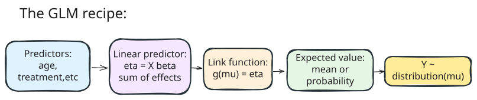

```{r profile-setup}
#| include: false
#| eval: false
source(file.path(Sys.getenv("QUARTO_PROJECT_DIR"), "scripts", "knitr-profile.R"))
enable_knitr_chunk_profile()
```

# Introduction

In the past couple of years, I have been working with a lot of healthcare datasets and databases and, whilst not a unique problem of this field, I often found myself with a lot of observations in which the predicted value ended up being zero, which made standard modelling techniques tricky to apply. In these cases, zero-inflated models come very handy, and are generally quite extensible to fit a wide variety of scenarios. But because of this extensibility, It can sometimes be difficult to understand how to correctly implement and interpret the results, and since this set of techniques does't  really fall under the "hot" machine learning umbrella of techniques, finding high quality learning resources can be a bit challenging, or at least it was for me (although they do exist)!

This tutorial was borne out of the notes that I made when applying zero-inflated models in industry, and the internal training sessions that I ran on the topic. The goal is to provide a practical, hands-on guide to understanding and implementing zero-inflated models. No background on this topic is necessary, and I will try to explain concepts in a clear and accessible manner, in the way it first helped me understand the topic!

This initial tutorial will set to cover the basic theoretical foundations, practical implementation, and interpretation of results for this class of models. In a follow-up tutorial, I might go into more depth into slightly more advanced topics, such as different distributions and generalizations that can be used, along with model selection and validation techniques.

In terms of tooling, I strongly recommend using the `glmmTMB` package in R, which is very flexible, widely adopted and considered industry-standard at the time of writing this article for fitting generalized linear models, which zero-inflated models fall under. The Python ecosystem for this task is not quite as mature yet, although for standard applications the `statsmodels` library is a good starting point - in fact, anything in this tutorial should be easily translatable if you decide to take that approach!

## What Are Zero-Inflation Models?

In regression analysis, zero-inflated models are a family of statistical methods used to analyze count data when there are more zeros than simple count models (like Poisson) expect. 

What does this actually mean? In plain terms: when you're counting events such as visits to a clinic, number of fish caught, defects on a product, and a lot of observations are zero, standard models can give misleading results.

Zero-inflated models help by explicitly accounting for two ways a zero can occur:

- one "structural" (the event cannot happen for some units)
- one "sampling" (the event could happen but didn't in that observation).

## When Do We Need Zero-Inflated Models?

Zero-inflated models address a fundamental challenge in count data analysis: **excess zeros**. Consider these real-world scenarios:

 - **Healthcare utilization (improved)**: Some patients are effectively unable to generate events because they never access services (structural zeros) — for example, people living in remote areas with no nearby clinics, or those excluded by policy or eligibility criteria. Other patients could use services but happen not to during the study window (sampling zeros) — for example, healthy patients who simply don't visit in that period or patients whose condition didn't require care.
 - **Disease surveillance (infection detection)**: Some locations truly have zero prevalence for a pathogen because the pathogen cannot survive there or has been eradicated (structural zeros). Other locations harbor the pathogen but a given survey fails to detect it during that sampling round (sampling zeros) — e.g., low prevalence or imperfect tests.
 - **Access to specialist treatments / prescriptions**: Some patients will never be eligible for a specific specialist-only procedure or advanced drug (structural zeros) — think of treatments restricted by age, comorbidity, or insurance coverage. Other patients are eligible but simply don't receive the treatment during the study window (sampling zeros) because they don't yet need it, they defer care, or the treatment is rarely used in short follow-up.

{#fig-zero-sources fig-alt="A hand-drawn flow diagram splitting healthcare count zeros into structural zeros from access or eligibility barriers and sampling zeros from no care needed or non-attendance."}

# Theoretical Foundation: Generalized Linear Models

## Why GLMs Matter for Zero-Inflated Models

Before diving into zero-inflated models, we need to understand **Generalized Linear Models (GLMs)** — the statistical framework that makes these advanced models possible. Think of GLMs as a powerful extension of ordinary linear regression that can handle different types of data: counts, yes/no responses, continuous positive values, and more.

**The key insight**: Regular linear regression assumes your outcome is continuous and normally distributed (like height or temperature). But what if you're counting discrete events (number of hospital visits) or dealing with yes/no outcomes (did the patient develop diabetes)? GLMs provide the mathematical machinery to handle these situations properly.

Zero-inflated models are sophisticated GLMs that combine two simpler GLM components. The original zero-inflated Poisson regression paper framed this as a practical way to model excess zeros in manufacturing defects [@lambert1992]; the same idea now appears across health, ecology, insurance, and many other count-data settings.

## The Exponential Family: The Mathematical Foundation

The **exponential family** is a collection of probability distributions that share a common mathematical structure. This might sound abstract, but it includes most distributions you encounter in practice: normal, Poisson, binomial, gamma, and many others.

**Why does this matter?** Distributions in the exponential family have nice mathematical properties that make them:

- Computationally efficient to work with
- Theoretically well-understood  
- Capable of being combined into complex models like zero-inflated models

A distribution belongs to the exponential family if its probability density can be written as:

$$f(y|\theta, \phi) = \exp\left\{\frac{y\theta - b(\theta)}{\phi} + c(y, \phi)\right\}$$

**You don't need to memorize this!** The only important part is that this format essentially *standardises* how we work with different distributions. The components are:

- $\theta$ is the **natural parameter** (relates to the mean)
- $\phi$ is the **dispersion parameter** (relates to the variance)
- $b(\cdot)$ and $c(\cdot)$ are specific functions that define each distribution type

### Key Examples with Real-World Context

**Bernoulli Distribution** (for yes/no outcomes):
$$f(y|\mu) = \mu^y(1-\mu)^{1-y} = \exp\left\{y \log\left(\frac{\mu}{1-\mu}\right) + \log(1-\mu)\right\}$$

**Real-world use**: Did the patient develop diabetes? Did the treatment work? Will the customer purchase?

This gives us:

- Natural parameter: $\theta = \log\left(\frac{\mu}{1-\mu}\right)$ (logit transformation)
- Canonical link: logit link

**Why logit link?** Probabilities must be between 0 and 1, but linear combinations can be any value. The logit link maps any real number to a valid probability.

**Practical Healthcare Example**: Predicting whether a patient will develop Type 2 diabetes based on BMI, age, and family history.

- **The setup**: Bernoulli distribution with logit link $\log\left(\frac{\pi}{1-\pi}\right) = X\beta$
- **Interpretation**: $\exp(\beta_j)$ = odds ratio for a unit change in predictor $x_j$
- **In plain English**: If BMI has coefficient 0.1, then each unit increase in BMI multiplies the odds of diabetes by $e^{0.1} = 1.105$ (about 10.5% increase)
- **Key benefit**: The logit link ensures our predicted probabilities stay between 0 and 1

**Poisson Distribution** (for counting rare events):
$$f(y|\mu) = \frac{\mu^y e^{-\mu}}{y!} = \exp\{y \log \mu - \mu - \log y!\}$$

**Real-world use**: Counting hospital admissions per month, number of accidents per day, or doctor visits per year.

The Poisson gives us:

- Natural parameter: $\theta = \log \mu$ (working on the log scale)
- Cumulant function: $b(\theta) = e^\theta = \mu$ 
- Canonical link: $\log(\mu)$ (log link)

**Why log link?** Because counts can't be negative, but our predictors might push the linear combination negative. The log link ensures our predicted counts are always positive.

**Practical Healthcare Example**: Modeling the number of emergency department visits per patient per year based on age, chronic conditions, and socioeconomic status.

- **The setup**: Poisson distribution with log link $\log(\lambda) = X\beta$  
- **Interpretation**: $\exp(\beta_j)$ = multiplicative effect on the rate for a unit change in $x_j$
- **In plain English**: If having diabetes has coefficient 0.5, then diabetic patients have $e^{0.5} = 1.65$ times the visit rate (65% more visits)
- **Key assumption**: $E[Y] = \text{Var}(Y) = \lambda$ (equidispersion)
- **When this breaks down**: If you see many more zeros than Poisson predicts, or if the variance is much larger than the mean, you need zero-inflated or overdispersed models.

## Generalized Linear Models (GLMs): Putting It Together

Think of a GLM as having three essential ingredients, like a recipe:

1. **Linear predictor** ($\eta = X\beta$): This is the familiar part — a linear combination of your predictors
2. **Link function** ($g(\mu) = \eta$): This connects your linear predictor to the expected value of your outcome
3. **Response distribution**: From the exponential family (Poisson, binomial, etc.)

{#fig-glm-pipeline fig-alt="A hand-drawn left-to-right pipeline: predictors, linear predictor, link function, expected response, and observed outcome distribution."}

**The beauty of this system**: You can mix and match different link functions and distributions to model different types of data appropriately.

# Practical Implementation: Foundation Models

## Package Installation

Before starting, install the required packages:

```{r install}
#| eval: false
# Install packages if not already available
install.packages(c("glmmTMB", "DHARMa", "performance", "parameters", "MASS", 
                   "ggplot2", "dplyr", "gridExtra", "knitr", "caret", "catdata"))
```

## Loading Healthcare Data

We'll use a real healthcare dataset to demonstrate zero-inflated models. The `medcare` dataset from the `catdata` package contains information about healthcare utilization among Medicare beneficiaries.

```{r load_libraries}
#| message: false
#| warning: false
# Load required packages
library(glmmTMB)
library(DHARMa)
library(performance)
library(parameters)
library(MASS)
library(ggplot2)
library(dplyr)
library(gridExtra)
library(knitr)
library(catdata)
```

```{r load_data}
#| message: false
# Load the medical care dataset
data(medcare)

# Examine the structure of the data
head(medcare)
glimpse(medcare)
```

**What this dataset contains:**

- `ofp`: Number of physician office visits (our count outcome)
- `hosp`: Number of hospital stays
- `healthpoor`: Individual has poor health (reference: average health)
- `healthexcellent`: Individual has excellent health  
- `numchron`: Number of chronic conditions
- `male`: Gender (female = 0, male = 1)
- `age`: Age (centered around 60)
- `married`: Marital status (married = 1, else = 0)
- `school`: Years of education

## Understanding the Data: Why Zero-Inflation Matters

Let's explore the key characteristics that suggest we need zero-inflated models:

```{r tbl-doctor-visit-summary}
#| echo: false
#| code-fold: true
#| code-summary: "Show summary table code"
#| tbl-cap: "Doctor visits (`ofp`) summary."
library(dplyr)
library(knitr)

stats_tbl <- tibble::tibble(
  Metric = c("Proportion of zeros", "Mean visits", "Variance", "Variance-to-mean ratio"),
  Value = c(
    round(mean(medcare$ofp == 0), 3),
    round(mean(medcare$ofp), 2),
    round(var(medcare$ofp), 2),
    round(var(medcare$ofp)/mean(medcare$ofp), 2)
  )
)

knitr::kable(stats_tbl)
```

```{r tbl-doctor-visit-counts}
#| echo: false
#| code-fold: true
#| code-summary: "Show visit count table code"
#| tbl-cap: "Frequency of the first ten observed visit counts."
# First 10 frequency counts
freqs <- as.data.frame(table(medcare$ofp))
names(freqs) <- c("visits", "count")
knitr::kable(head(freqs, 10))
```

**Key observations:**

- **High proportion of zeros**: Many people didn't visit a doctor at all
- **Overdispersion**: Variance much larger than mean (typical of real healthcare data)
- **Right-skewed distribution**: Most people have few visits, but some have many

## Visualizing Zero-Inflation

```{r}
#| echo: false
#| code-fold: true
#| code-summary: "Show visualization code"
#| label: fig-zero-inflation-eda
#| fig-cap:
#|   - "Distribution of physician office visits, zoomed to the most common range."
#|   - "Zero-visit proportions vary across self-reported health status."
#|   - "Zero-visit proportions fall as the number of chronic conditions rises."
#| fig-alt:
#|   - "Histogram of doctor visits with a tall bar at zero and a right-skewed distribution of low visit counts."
#|   - "Bar chart comparing the proportion of zero visits for poor, average, and excellent health status."
#|   - "Bar chart showing lower proportions of zero visits among patients with more chronic conditions."

# Create comprehensive visualization
p1 <- ggplot(medcare, aes(x = ofp)) +
  geom_histogram(binwidth = 1, fill = "lightblue", alpha = 0.7, color = "black") +
  labs(title = "Distribution of Doctor Visits", 
       x = "Number of Office Visits", y = "Frequency") +
  theme_minimal() +
  xlim(0, 20)  # Focus on reasonable range

# Zero inflation by health status  
p2 <- medcare %>%
  mutate(health_status = case_when(
    healthpoor == 1 ~ "Poor",
    healthexcellent == 1 ~ "Excellent", 
    TRUE ~ "Average"
  )) %>%
  # ensure desired order for plotting
  mutate(health_status = factor(health_status, levels = c("Poor", "Average", "Excellent"))) %>%
  group_by(health_status) %>%
  summarise(prop_zeros = mean(ofp == 0),
            mean_visits = mean(ofp), 
            .groups = 'drop') %>%
  ggplot(aes(x = health_status, y = prop_zeros)) +
  geom_col(fill = "coral", alpha = 0.7, color = "black") +
  labs(title = "Proportion of Zero Visits by Health Status", 
       x = "Health Status", y = "Proportion of Zeros") +
  theme_minimal()

# Zero inflation by chronic conditions
p3 <- medcare %>%
  group_by(numchron) %>%
  summarise(prop_zeros = mean(ofp == 0),
            count = n(),
            .groups = 'drop') %>%
  filter(count >= 20) %>%  # Only groups with sufficient data
  ggplot(aes(x = factor(numchron), y = prop_zeros)) +
  geom_col(fill = "lightgreen", alpha = 0.7, color = "black") +
  labs(title = "Proportion of Zero Visits by Chronic Conditions", 
       x = "Number of Chronic Conditions", y = "Proportion of Zeros") +
  theme_minimal()

# Combine plots
print(p1)
print(p2)
print(p3)
```

**What we observe:**

- People in excellent health have many more zero visits (structural zeros)
- Those with more chronic conditions rarely have zero visits
- This suggests **two distinct processes** generating zeros

## Foundation Models: Step-by-Step Analysis

Now let's build our understanding by starting with simpler models before moving to zero-inflated approaches. This step-by-step approach helps us understand:

1. **The zero-inflation component**: By modeling zeros vs non-zeros, we identify factors that create "structural zeros"
2. **The count component**: By modeling visit counts, we understand factors affecting healthcare utilization intensity  
3. **The need for complex models**: By comparing simple models to our data, we see why zero-inflated models are necessary

This methodical approach mirrors the actual components of zero-inflated models, making the final models more interpretable.

### Step 1: Logistic Regression for Zero vs Non-Zero

First, let's model the probability of having **any** doctor visits versus none. This analysis mirrors the zero-inflation component of ZIP/ZINB models.

**Why this matters**: Understanding what predicts zero visits helps us identify "structural zeros" - people who systematically don't use healthcare due to access barriers, excellent health, or philosophical reasons, rather than random chance.

```{r logistic_analysis}
#| cache: true
#| code-fold: true
#| code-summary: "Show logistic regression analysis"
# Create binary indicator: 1 = zero visits, 0 = any visits
medcare$no_visits <- ifelse(medcare$ofp == 0, 1, 0)

# Fit logistic regression
logistic_model <- glm(no_visits ~ healthpoor + healthexcellent + numchron + age + male + married, 
                     data = medcare, family = binomial())

summary(logistic_model)

# Interpret key coefficients using easystats
library(parameters)

# Get model parameters with confidence intervals and interpretation
model_params <- model_parameters(logistic_model, exponentiate = TRUE)
print(model_params)

# Create interpretation summary
coefs <- coef(logistic_model)
or_values <- exp(coefs)

interpretation_df <- data.frame(
  Variable = c("Health (excellent vs average)", "Health (poor vs average)", 
               "Each chronic condition", "Age (per year)"),
  OR = round(c(or_values["healthexcellent"], or_values["healthpoor"], 
               or_values["numchron"], or_values["age"]), 2),
  Interpretation = c(
    paste0(round((or_values["healthexcellent"] - 1) * 100, 1), "% higher odds of zero visits"),
    paste0(round((or_values["healthpoor"] - 1) * 100, 1), "% higher odds of zero visits"),
    paste0(round((1 - or_values["numchron"]) * 100, 1), "% lower odds per condition"),
    paste0(round((1 - or_values["age"]) * 100, 1), "% lower odds per year")
  )
)

print(interpretation_df, row.names = FALSE)
```

**What this tells us:**

- **Excellent health**: Much higher odds of zero visits (structural zeros)
- **Poor health**: Higher odds of zero visits (potentially due to access barriers or avoidance)
- **Chronic conditions**: Dramatically reduce odds of zero visits
- **Age**: Older patients less likely to have zero visits

### Step 2: Poisson Regression for Count Data

Now let's model the count of visits using standard Poisson regression. This analysis mirrors the count component of ZIP/ZINB models.

**Why this approach**: Poisson regression is the foundation for count data modeling. By starting here, we can:

- Understand the baseline relationships between predictors and visit counts
- Identify overdispersion (variance > mean), which suggests we need more flexible models
- Establish a baseline for model comparison

**Key Poisson assumptions:**

1. **Independence**: Each visit is independent 
2. **Equidispersion**: Variance equals the mean ($\text{Var}(Y) = E[Y]$)
3. **Non-negative integers**: Counts are 0, 1, 2, 3, etc.

When these assumptions are violated (especially #2), we need more sophisticated models.

```{r poisson_analysis}
#| cache: true
#| code-fold: true
#| code-summary: "Show Poisson regression analysis"
# Fit Poisson model
poisson_model <- glm(ofp ~ healthpoor + healthexcellent + numchron + age + male + married, 
                    data = medcare, family = poisson())

summary(poisson_model)

# Check for overdispersion using performance package
overdispersion_check <- check_overdispersion(poisson_model)
print("=== OVERDISPERSION CHECK ===")
print(overdispersion_check)

# Additional performance diagnostics
model_performance_metrics <- model_performance(poisson_model)
print(model_performance_metrics)

# Interpret key coefficients using easystats
poisson_params <- model_parameters(poisson_model, exponentiate = TRUE)
print("=== KEY INTERPRETATIONS (Multiplicative Effects) ===")
print(poisson_params)
```

**Critical insight**: The massive overdispersion (ratio >> 1) tells us that:

- Standard Poisson is **inadequate** for this data
- We need models that account for both **excess zeros** and **overdispersion**
- This is exactly what zero-inflated negative binomial models address!

**Why overdispersion matters**: In Poisson regression, we assume the variance equals the mean. When the variance is much larger (overdispersion), our standard errors are too small, leading to overconfident statistical tests and potentially incorrect conclusions about which variables are significant.

### Step 3: Comparing Observed vs Expected Zeros

Let's see how many zeros each model predicts compared to what we actually observe. This is the crucial diagnostic that tells us whether we need zero-inflated models.

**The logic**: If Poisson regression adequately captures the data-generating process, it should predict approximately the right number of zeros. If we observe many more zeros than Poisson predicts, this suggests "excess zeros" that require zero-inflated modeling.

**Mathematical background**: For a Poisson distribution with parameter $\lambda$, the probability of observing zero is $P(Y=0) = e^{-\lambda}$. We can use this to calculate expected zeros from our fitted model.

```{r}
#| code-fold: true
#| code-summary: "Show zero-inflation comparison analysis"
#| label: tbl-zero-comparison
#| tbl-cap: "Observed zero visits compared with the zeros expected from the fitted Poisson model."
# Observed zeros
observed_zeros <- sum(medcare$ofp == 0)
total_obs <- nrow(medcare)

# Predicted zeros from Poisson model
poisson_pred <- predict(poisson_model, type = "response")
poisson_zero_prob <- exp(-poisson_pred)  # P(Y=0) for Poisson
expected_zeros_poisson <- sum(poisson_zero_prob)

# Use performance package to check zero-inflation. Folded output is useful
# for readers who want the diagnostic object.
zero_inflation_check <- check_zeroinflation(poisson_model)
print(zero_inflation_check)

# Manual comparison for educational purposes
observed_zeros <- sum(medcare$ofp == 0)
total_obs <- nrow(medcare)

# Predicted zeros from Poisson model
poisson_pred <- predict(poisson_model, type = "response")
poisson_zero_prob <- exp(-poisson_pred)  # P(Y=0) for Poisson
expected_zeros_poisson <- sum(poisson_zero_prob)

# Create comparison table for the article body.
zero_comparison <- data.frame(
  Metric = c("Observed zeros", "Expected zeros (Poisson)", "Excess zeros"),
  Count = c(observed_zeros, round(expected_zeros_poisson), 
            observed_zeros - round(expected_zeros_poisson)),
  Percentage = c(round(100*observed_zeros/total_obs, 1),
                round(100*expected_zeros_poisson/total_obs, 1),
                round(100*(observed_zeros - expected_zeros_poisson)/total_obs, 1))
)

knitr::kable(zero_comparison)
```

**The smoking gun**: We observe 683 zero-visit records, while the Poisson model expects only about 37. That gap is the practical evidence that a one-process count model is missing something important.

# Zero-Inflated Models: Theory and Implementation

## The Core Concept: Two-Process Thinking

Now that we've established the need for zero-inflated models, let's understand exactly **how** they work. The key insight is deceptively simple: **not all zeros are created equal**.

Think of zero-inflated models as having two interconnected parts working together, like a two-stage screening process:

{#fig-zero-inflated-process fig-alt="A hand-drawn two-stage model diagram: a new patient enters a zero-inflation process, which either produces a structural zero or passes the patient to a count process that can produce a sampling zero or one or more visits."}

**The beauty of this approach**: We can model the factors that influence each stage separately, giving us much richer insights than simple count models.

## Real-World Healthcare Example: Breaking Down the Process

Let's apply this two-stage thinking to our medical care data. Imagine we're trying to understand doctor visit patterns:

**Stage 1 - Zero-Inflation Process** ("Will this person access healthcare at all?")

- **Factors pushing toward structural zeros**: Excellent health status, young age, male gender, geographic barriers, insurance issues
- **Question**: What's the probability this person belongs to the "never visits doctors" group?

**Stage 2 - Count Process** ("Given they do access healthcare, how often?")

- **Factors affecting visit frequency**: Number of chronic conditions, poor health status, age, social support
- **Question**: For people who do use healthcare, what drives the number of visits?

This separation allows us to identify, for example, that **excellent health** primarily affects whether someone visits doctors at all (Stage 1), while **chronic conditions** primarily affect how often they visit (Stage 2).

## Mathematical Formulation: Making the Intuition Concrete

Don't let the mathematics intimidate you — they're just formalizing the two-stage process we described above.

### Zero-Inflated Poisson (ZIP) Model

The ZIP model mathematically expresses our two-stage process:

**For zeros (no doctor visits):**
$$P(Y = 0) = \pi + (1-\pi)e^{-\lambda}$$

**For positive counts (1, 2, 3, ... visits):**
$$P(Y = k) = (1-\pi)\frac{\lambda^k e^{-\lambda}}{k!}, \quad k = 1, 2, 3, ...$$

**Breaking this down in plain English:**

- $\pi$ = probability of being a "structural zero" (never visits doctors)
- $(1-\pi)$ = probability of being a "potential healthcare user"  
- $\lambda$ = expected visit rate for potential users
- $e^{-\lambda}$ = probability a potential user happens to have zero visits (sampling zero)

**The key insight**: Total probability of zero visits = structural zeros + sampling zeros from potential users.

**Practical Healthcare Interpretation:**

Let's say we estimate $\pi = 0.15$ and $\lambda = 3.2$ for a typical patient profile:

- **15%** of patients are structural zeros (never visit doctors)
- **85%** are potential healthcare users with average rate 3.2 visits/year
- Among potential users, $e^{-3.2} = 4.1\%$ happen to have zero visits by chance
- **Total zero probability** = 15% + 85% × 4.1% = 18.5%

### Understanding Mean and Variance

**Expected visits:** $E[Y] = (1-\pi)\lambda$
- Only the $(1-\pi)$ proportion who are potential users contribute to the mean
- In our example: $E[Y] = 0.85 \times 3.2 = 2.72$ visits on average

**Variance:** $\text{Var}(Y) = \lambda(1-\pi)(1 + \pi\lambda)$
- Always larger than the mean: $\text{Var}(Y) > E[Y]$ (natural overdispersion)
- In our example: $\text{Var}(Y) = 3.2 \times 0.85 \times (1 + 0.15 \times 3.2) = 4.04$

**Why this matters**: The built-in overdispersion (variance > mean) helps explain the extra variability we see in real healthcare data that simple Poisson models miss.

### Zero-Inflated Negative Binomial (ZINB) Model

The ZINB model adds another layer of flexibility for handling even more overdispersion:

**For zeros:**
$$P(Y = 0) = \pi + (1-\pi)\left(\frac{r}{r+\mu}\right)^r$$

**For positive counts:**
$$P(Y = k) = (1-\pi)\frac{\Gamma(k+r)}{k!\Gamma(r)}\left(\frac{r}{r+\mu}\right)^r\left(\frac{\mu}{r+\mu}\right)^k$$

**What's different from ZIP:**

- Uses negative binomial instead of Poisson for the count component
- Parameter $r$ controls additional overdispersion within the potential user group
- When $r \to \infty$, ZINB reduces to ZIP (nested models)

**When to use ZINB over ZIP:**

- When you have **excess zeros AND** heavy overdispersion in the count component
- Healthcare data often shows both patterns: some people never use services (excess zeros) and among users, visit patterns are highly variable (overdispersion)

## Building Intuition: A Step-by-Step Example

Let's walk through fitting our first zero-inflated model using the healthcare data, building intuition at each step.

### Step 1: Choosing Variables for Each Component

**Key decision**: Which variables should influence the zero-inflation process vs the count process?

**Theoretical guidance for healthcare data:**

- **Zero-inflation predictors**: Factors affecting healthcare access/utilization barriers
  - Health status (excellent health → less likely to need care)
  - Demographics (young males often avoid preventive care)
  - Socioeconomic factors (insurance, geographic access)

- **Count predictors**: Factors affecting intensity of healthcare use among users
  - Chronic conditions (more conditions → more visits)
  - Poor health status (sicker people visit more often)
  - Age (older patients typically have more complex needs)

**In practice**: You can use the same variables in both components or different sets, depending on your theoretical understanding and empirical evidence.

## Practical Implementation: From Theory to Code

Now let's implement zero-inflated models using our healthcare data, building step-by-step understanding.

### Setting Up the Healthcare Models

```{r healthcare_zero_inflated}
#| cache: true
#| code-fold: true
#| code-summary: "Show zero-inflated model implementation"
# We'll fit both ZIP and ZINB models to our healthcare data
# Using the same structure as our foundation models but with zero-inflation

# Zero-Inflated Poisson (ZIP) model
zip_model <- glmmTMB(ofp ~ healthpoor + healthexcellent + numchron + age + male + married,
                     ziformula = ~ healthexcellent + age + male,
                     data = medcare,
                     family = poisson())

# Zero-Inflated Negative Binomial (ZINB) model  
zinb_model <- glmmTMB(ofp ~ healthpoor + healthexcellent + numchron + age + male + married,
                      ziformula = ~ healthexcellent + age + male,
                      data = medcare,
                      family = nbinom2())

# Display summaries with interpretation
print("=== Zero-Inflated Poisson Model ===")
summary(zip_model)

print("=== Zero-Inflated Negative Binomial Model ===")
summary(zinb_model)
```

**Understanding the Model Syntax:**

- **Main formula**: `ofp ~ healthpoor + healthexcellent + numchron + age + male + married`  
  - Predicts visit **counts** for people who do use healthcare
  - Focuses on factors affecting utilization intensity

- **Zero-inflation formula**: `ziformula = ~ healthexcellent + age + male`  
  - Predicts probability of being a "structural zero" (never visits)
  - Focuses on factors affecting access/participation

**Why this variable selection makes sense:**

- **Excellent health** appears in zero-inflation (affects whether you visit at all) but count model captures this through both excellent and poor health
- **Age and gender** affect both participation and intensity differently  
- **Chronic conditions** primarily affect intensity (people with more conditions visit more), not whether they participate

## Interpreting Zero-Inflated Model Results

Understanding zero-inflated model output requires interpreting **two separate sets of coefficients**. Let's break this down systematically.

```{r zi_interpretation}
#| code-fold: true
#| code-summary: "Show interpretation of zero-inflated model results"
# Extract and interpret results from ZINB model using easystats
zinb_params <- model_parameters(zinb_model)
print(zinb_params)

# Separate the two components for clearer interpretation
count_coefs <- fixef(zinb_model)$cond
zi_coefs <- fixef(zinb_model)$zi

# Convert to interpretable scales
count_effects <- exp(count_coefs)
count_df <- data.frame(
  Variable = names(count_effects),
  Rate_Ratio = round(count_effects, 2),
  Percent_Change = paste0(round((count_effects - 1) * 100, 1), "%"),
  Interpretation = c(
    "Baseline visit rate",
    "Poor health vs average health",
    "Excellent health vs average health", 
    "Each additional chronic condition",
    "Each additional year of age",
    "Male vs female",
    "Married vs unmarried"
  )
)
knitr::kable(
  count_df[, c("Variable", "Rate_Ratio", "Percent_Change", "Interpretation")],
  caption = "Count component: multiplicative effects on expected visit rates.",
  row.names = FALSE
)

zi_probs <- plogis(zi_coefs)
zi_odds <- exp(zi_coefs)
zi_df <- data.frame(
  Variable = names(zi_probs),
  Odds_Ratio = round(zi_odds, 2),
  Baseline_Prob = round(zi_probs, 3),
  Interpretation = c(
    "Baseline odds of never visiting",
    "Excellent health effect on never visiting",
    "Age effect on never visiting", 
    "Male effect on never visiting"
  )
)
knitr::kable(
  zi_df[, c("Variable", "Odds_Ratio", "Interpretation")],
  caption = "Zero-inflation component: odds ratios for belonging to the structural-zero group.",
  row.names = FALSE
)
```

### Key Healthcare Insights from the Model

**From the Count Component** (visit rates among users):

- **Chronic conditions**: Each additional condition increases the visit rate by about 20% among healthcare users.
- **Poor health**: Poor health is associated with about 32% more visits among healthcare users.
- **Age**: In this fitted model, age is associated with slightly fewer visits in the count component, while also affecting the zero-inflation component.
- **Excellent health**: Even among healthcare users, excellent health is associated with a lower visit rate.

**From the Zero-Inflation Component** (probability of never visiting):

- **Excellent health**: Much higher odds of being a "never visitor"
- **Age**: Older people less likely to be "never visitors" (more health needs emerge)
- **Gender**: Males more likely to be "never visitors" (avoidance of preventive care)

**The complete picture**: These models reveal that excellent health status **primarily** operates by affecting whether people participate in healthcare at all, while chronic conditions **primarily** affect how intensively people use healthcare once they're in the system.

## Comparing Model Performance: Why ZINB Usually Wins

Let's systematically compare our models to understand which performs best and why.

```{r healthcare_model_comparison}
#| code-fold: true
#| cache: true
#| code-summary: "Show model comparison analysis"
# Compare all our healthcare models
models <- list(
  "Poisson" = poisson_model,
  "ZIP" = zip_model, 
  "ZINB" = zinb_model
)

# Get comprehensive comparison metrics
comparison_table <- compare_performance(models, metrics = c("AIC", "BIC", "RMSE"))
print("=== MODEL COMPARISON METRICS ===")
print(comparison_table)

# Likelihood ratio tests for nested models
print("\n=== STATISTICAL TESTS FOR MODEL SELECTION ===")

# Test if ZIP is better than Poisson
if("glm" %in% class(poisson_model) && "glmmTMB" %in% class(zip_model)) {
  # For mixed model comparison, use AIC difference
  aic_diff_zip <- AIC(zip_model) - AIC(poisson_model)
  print(paste("ZIP vs Poisson AIC difference:", round(aic_diff_zip, 2)))
  if(aic_diff_zip < -2) {
    print("ZIP significantly better than Poisson")
  }
} else {
  lrt_zip <- anova(zip_model, poisson_model)
  if(!is.null(lrt_zip$`Pr(>Chisq)`)) {
    print(paste("ZIP vs Poisson p-value:", round(lrt_zip$`Pr(>Chisq)`[2], 4)))
  }
}

# Test if ZINB is better than ZIP
aic_diff_zinb <- AIC(zinb_model) - AIC(zip_model)
print(paste("ZINB vs ZIP AIC difference:", round(aic_diff_zinb, 2)))
if(aic_diff_zinb < -2) {
  print("ZINB significantly better than ZIP")
} else {
  print("ZIP and ZINB perform similarly")
}

# Check which model best handles zero-inflation
print("\n=== ZERO INFLATION HANDLING ===")
zi_check_zip <- check_zeroinflation(zip_model)
zi_check_zinb <- check_zeroinflation(zinb_model)
print("ZIP model zero-inflation check:")
print(zi_check_zip)
print("ZINB model zero-inflation check:")
print(zi_check_zinb)
```

**Why ZINB typically wins in healthcare data:**

1. **Addresses both problems**: Excess zeros AND overdispersion in the count component
2. **More flexible**: Can handle the high variability typical in healthcare utilization
3. **Better fit**: Lower AIC/BIC values indicate superior model fit
4. **Robust diagnostics**: Usually passes zero-inflation and overdispersion tests

## Practical Model Building Strategy

Here's a systematic approach to building zero-inflated models:

### Step 1: Start with Theory

**Before touching the data**, think about:

- What factors might create "structural zeros"?
- What factors affect intensity among participants?
- Should you use the same or different variables in each component?

### Step 2: Build Progressively

```{r progressive_building}
#| eval: false
#| code-fold: true
#| code-summary: "Show progressive model building strategy"
# Start simple, build complexity
model1 <- glmmTMB(ofp ~ healthexcellent + numchron,  # Basic count model
                  data = medcare, family = poisson())

model2 <- glmmTMB(ofp ~ healthexcellent + numchron,  # Add zero-inflation
                  ziformula = ~ healthexcellent,
                  data = medcare, family = poisson())

model3 <- glmmTMB(ofp ~ healthpoor + healthexcellent + numchron + age,  # More predictors
                  ziformula = ~ healthexcellent + age,
                  data = medcare, family = poisson())

model4 <- glmmTMB(ofp ~ healthpoor + healthexcellent + numchron + age,  # ZINB for overdispersion
                  ziformula = ~ healthexcellent + age,
                  data = medcare, family = nbinom2())

# Compare at each step
compare_performance(model1, model2, model3, model4)
```

### Step 3: Validate Your Choices

**Ask these questions:**

- Do the coefficient signs make theoretical sense?
- Does the model pass diagnostic tests?
- Are standard errors reasonable (not too large)?
- Do residual and performance checks support your model choice?

**Next section**: We'll cover comprehensive model diagnostics to ensure our zero-inflated models are trustworthy.

# Model Diagnostics with DHARMa and Performance

Proper diagnostics are crucial for zero-inflated models due to their complex structure.

```{r diagnostics}
#| eval: false
#| fig-height: 8
#| code-fold: true
#| code-summary: "Show DHARMa diagnostic analysis"
# DHARMa diagnostics for ZINB model
residuals_sim <- simulateResiduals(zinb_model, plot = FALSE)
plot(residuals_sim, main = "DHARMa Residuals for ZINB Model")

# Specific diagnostic tests
print("=== DHARMa Diagnostic Tests ===")
zero_test <- testZeroInflation(residuals_sim)
print(paste("Zero-inflation test p-value:", round(zero_test$p.value, 4)))

disp_test <- testDispersion(residuals_sim)  
print(paste("Dispersion test p-value:", round(disp_test$p.value, 4)))

outlier_test <- testOutliers(residuals_sim)
print(paste("Outliers test p-value:", round(outlier_test$p.value, 4)))
```

```{r performance_checks}
#| eval: false
#| code-fold: true
#| code-summary: "Show performance package diagnostics"
# Performance package diagnostics
print("=== Performance Package Diagnostics ===")
model_perf <- model_performance(zinb_model)
print(model_perf)

# Check specific issues
print("Overdispersion check:")
overdisp_check <- check_overdispersion(zinb_model)
print(overdisp_check)

print("Zero-inflation check:")
zi_check <- check_zeroinflation(zinb_model)
print(zi_check)
```

## Model Comparison

```{r model_comparison}
#| eval: false
#| code-fold: true
#| code-summary: "Show complete model comparison"
# Compare different model approaches
models <- list(
  "Poisson" = poisson_model,
  "ZIP" = zip_model, 
  "ZINB" = zinb_model
)

# Extract model comparison metrics
comparison_table <- compare_performance(models, metrics = c("AIC", "BIC", "RMSE"))
print(comparison_table)

# Likelihood ratio tests for nested models
print("=== Likelihood Ratio Tests ===")
# Test ZIP vs Poisson
lrt_zip <- anova(zip_model, poisson_model)
print(paste("ZIP vs Poisson: p-value =", round(lrt_zip$`Pr(>Chisq)`[2], 4)))

# Test ZINB vs ZIP  
lrt_zinb <- anova(zinb_model, zip_model)
print(paste("ZINB vs ZIP: p-value =", round(lrt_zinb$`Pr(>Chisq)`[2], 4)))
```

The ZINB model wins on all criteria, confirming our need for both zero-inflation and overdispersion modeling.

The next layer of model choice is deciding when a hurdle model, alternative count distribution, or prediction workflow is a better fit. That material is better handled as a separate advanced tutorial so this article can stay focused on the core zero-inflated modeling workflow.

# Summary and Best Practices

## Key Takeaways

1. **Zero-inflated models are useful** when excess zeros plausibly come from two distinct processes.
2. **ZINB often outperforms ZIP** when the data have both excess zeros and overdispersion.
3. **The zero-inflation and count components answer different questions**, so interpret them separately.
4. **Model diagnostics are crucial**; use checks for overdispersion, zero inflation, and residual behavior.
5. **Model choice should combine fit statistics and subject-matter reasoning**, not just the lowest AIC.

## Best Practices Checklist

✅ **Before modeling:**
- Explore your data for excess zeros
- Consider the data generating process theoretically
- Check for overdispersion in standard Poisson models

✅ **During modeling:**
- Compare Poisson, negative binomial, ZIP, and ZINB models
- Use different covariates for count and zero-inflation components when justified
- Check convergence and model diagnostics

✅ **After modeling:**
- Validate the chosen specification against residual and performance checks
- Interpret both components of the model
- Make predictions appropriate to your research questions

## When to Use Each Model Type

| Model Type | Best When | Avoid When |
|------------|-----------|------------|
| **Standard Poisson** | No excess zeros, equidispersed | Overdispersed or zero-inflated |
| **Negative Binomial** | Overdispersed but no excess zeros | Clear zero-inflation |
| **Zero-Inflated Poisson** | Excess zeros, minimal overdispersion | Heavy overdispersion |
| **Zero-Inflated NB** | Excess zeros AND overdispersion | Zero deflation |

: Practical guide for choosing among common count-data model families. {#tbl-model-choice}

## Further Reading

- Zeileis, Kleiber, and Jackman provide the practical R reference for count-data models, including Poisson, negative binomial, hurdle, and zero-inflated specifications [@zeileis2008].
- Lambert's paper is the classic zero-inflated Poisson reference [@lambert1992].
- Mullahy's paper is the foundational reference on modified count-data models, including hurdle-style thinking [@mullahy1986].

---

*This tutorial provides a practical foundation for zero-inflated modeling. The choice of model should always be guided by both statistical evidence and theoretical understanding of your data generating process.*

# References

::: {#refs}
:::
